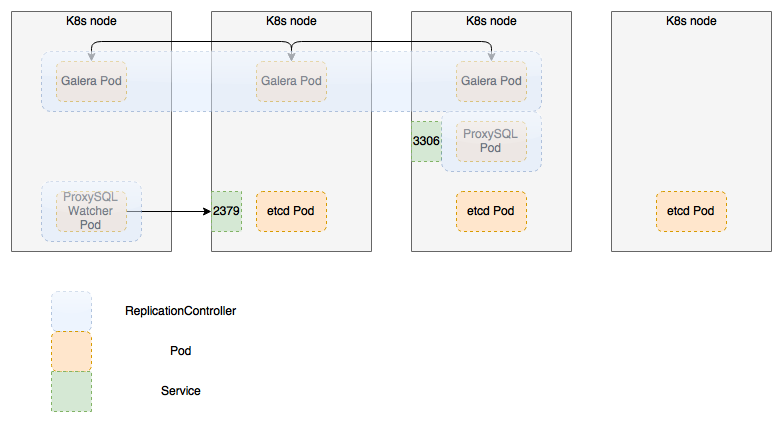

.. _clusters_on_k8s:

======================
Clusters On Kubernetes
======================

This document describes an architecture of Galera and RabbitMQ Clusters
running in containers within Kubernetes pods and how to setup those in
OpenStack on top of Kubernetes from deployment and networking
standpoints. In addition to it, this document includes overview of
alternative solutions for implementing database and message queue for
OpenStack.

RabbitMQ Architecture with K8s
==============================

Clustering
~~~~~~~~~~

The prerequisite for High Availability of queue server is the configured
and working RabbitMQ cluster. All data/state required for the operation
of a RabbitMQ cluster is replicated across all nodes. An exception to
this is content of message queues, which by default reside on one node, though
queues themselves are visible and reachable from all nodes. [1]

There are a lot of possible approaches to RabbitMQ clustering on top
of k8s, but they all share some common pitfals.

RabbitMQ nodes naming
~~~~~~~~~~~~~~~~~~~~~

The very first problem is what kind of names we should use to make
rabbits seeing each other. Here are some examples of such names in
different form:

- ``rabbit@hostname``

- ``rabbit@hostname.domainname``

- ``rabbit@172.17.0.4``

Even before trying to start any rabbits, you need to be sure that
containers can reach each other using selected naming scheme -
e.g. ``ping`` should work with the part that comes after the ``@``.

Erlang distribution (which is actively used by RabbitMQ) can run in
one of two naming modes: short names or long names. Rule of thumb is
that it's long when it contains ``.`` and short otherwise. For name
examples from above that means that the first one is the short name,
and the second and the third are the long names.

Looking at all this we see that on k8s we have following options for
naming nodes:

- Use `PetSets <http://kubernetes.io/docs/user-guide/petset/>`_ so we
  will have some stable DNS names

- Use IP-addresses and some sort of automatic peer discovery (like
  `autocluster plugin
  <https://github.com/aweber/rabbitmq-autocluster/>`_).

Both these options require running in long-name mode, but the way in
which DNS/hostnames are configured inside k8s pods is incompatible
with RabbitMQ versions prior to 3.6.6 (`fix
<https://github.com/rabbitmq/rabbitmq-server/issues/890/>`_).

Clustering gotchas
~~~~~~~~~~~~~~~~~~

Another important things to know about RabbitMQ clusters is that
when a node joins to a cluster, its data will be lost no matter
what. It doesn't matter in the most common case - when it's the
clean node that is joining the cluster, as we have nothing to
lose in this case. But if we have 2 nodes that operated
independently for some time and accumulated some data, there is no
way to join them without any loss (note that restoring a cluster
after network-split or node outage is just a special case of the
same thing and also happens with data loss). For a specific workload you
can invent some workarounds, like draining (manually or
automatically) the nodes that are bound to be reset. But there is
just no way for making such solution robust, automatic and
universal.

So our choice of automatic clustering solution is heavily
influenced by kind of data loss we can tolerate for our
concrete workloads.

Replication
~~~~~~~~~~~

Replication mechanism for RabbitMQ queues is known as 'mirroring'. By
default, queue content within a RabbitMQ cluster is located on a single node
(the node on which they were first declared). This is in contrast to
exchanges and bindings, which can always be considered to be on all
nodes. Queue content can optionally be mirrored across multiple nodes.
Each mirrored queue consists of one master and one or more slaves, with
the oldest slave being promoted to the new master if the old master
disappears for any reason. [2]

Messages published to the queue are replicated to all members of the
cluster. Consumers are interacting with the master regardless of which node
they connect to, with slave nodes dropping messages that have been
acknowledged at the master. Queue mirroring therefore aims to enhance
availability, but does not distribute load across nodes (all
participating nodes each do all the work). It is important to note that
using mirroring in RabbitMQ actually reduces the availability of queues
by dropping performance by about 2 times in `performance
tests <http://docs.openstack.org/developer/performance-docs/test_results/mq/rabbitmq/index.html>`__.

Also there was significant amount of bugs in mirroring
implementation that in the end had lead to unnecessary node
restarts. See below the partial list of such bugs [6-13]. RabbitMQ
3.6.6 is a lot more stable in that respect, but we cannot be sure that
all those issues were rooted out.

There are two main types of messages in OpenStack:

-  Remote Procedure Call messages carry commands and/or requests between
   microservices within a single component of OpenStack platform
   (e.g. nova-conductor to nova-compute).

-  Notification messages are issued by a microservice upon specific
   events and are consumed by other components (e.g. Nova
   notifications about creating VMs are consumed by Ceilometer).

In proposed OpenStack architecture, only notification queues are
mirrored as they require durability and should survive a failure of any
single node in the cluster. All other queues are not, and if the
instance of RabbitMQ server that hosts a particular queue fails after a
message sent to that queue, but before it is read, that message is gone
forever. This is a trade-off for significant (2 times) performance boost
in potential bottleneck service. Potential drawbacks of this mode of
operation are:

-  Long-running tasks might stuck in transition states due to loss of
   messages. For example, Heat stacks might never leave spawning
   state. Most of the time, such conditions could be fixed by the
   user via API.

Data Persistence
~~~~~~~~~~~~~~~~

OpenStack does not impose requirements for durable queues or messages.
Thus, no durability required for RabbitMQ queues, and there is no 'disk'
nodes in cluster. Restarting a RabbitMQ node then will cause all data of
that node to be lost, both for RPC and Notification messages.

- RPC messages are not supposed to be guaranteed, thus no persistence is
  needed for them.

- Notifications will be preserved by mirroring if single RabbitMQ node
  fails (see above).

Networking Considerations
~~~~~~~~~~~~~~~~~~~~~~~~~

Clustering is meant to be used across LAN. It is not recommended to
run clusters that span across WAN.

The `Shovel <https://www.rabbitmq.com/shovel.html>`__ or `Federation
<https://www.rabbitmq.com/federation.html>`__ plugins are better
solutions for connecting brokers across a WAN. Note that `Shovel and
Federation are not equivalent to clustering
<https://www.rabbitmq.com/distributed.html>`__ and they are not
suitable for RPC workloads. [1]

Cluster formation options
~~~~~~~~~~~~~~~~~~~~~~~~~
Here are some of our options.

rabbit-autocluster
^^^^^^^^^^^^^^^^^^
`rabbitmq-autocluster <https://github.com/aweber/rabbitmq-autocluster>`__

Custom startup script
^^^^^^^^^^^^^^^^^^^^^

We can implement something like `OCF script
<https://github.com/rabbitmq/rabbitmq-server-release/blob/master/scripts/rabbitmq-server-ha.ocf>`_.
With the guarantees provided by PetSets that only one node is
performing startup at any given time it should work reasonably well.

rabbit-clusterer
^^^^^^^^^^^^^^^^

`rabbitmq-clusterer <https://github.com/rabbitmq/rabbitmq-clusterer>`__

Plugin 'rabbitmq-clusterer' employs more opinionated and less
generalized approach to the cluster assembly solution. It also cannot
be directly integrated with etcd and other K8s configuration management
mechanisms because of `static
configuration <https://github.com/rabbitmq/rabbitmq-clusterer/blob/master/README.md#cluster-configuration>`__.
Additional engineering efforts are required to implement configuration
middleware. Because of that it is considered a fallback solution.

Kubernetes Integration
~~~~~~~~~~~~~~~~~~~~~~

Proposed solution for running RabbitMQ cluster under Kubernetes is a
`DaemonSet <http://kubernetes.io/docs/admin/daemons/>`__ with node
labels to specify which nodes will run RabbitMQ servers. This will allow
to move the cluster onto a set of dedicated nodes, if necessary, or run
them on the same nodes as the other control plane components.

Assuming that we've solved all naming-related problems and can cluster
your rabbits manually using ``rabbitmqctl``, it's time to make our
cluster assembly automatic. Bearing all the considerations from the
above in mind, we can start desiging our solution. The less state the
better, so using IP-addresses is preferable to using PetSets. And the
autocluster plugin is our obvious candidate for forming a cluster from
a bunch of dynamic disposable nodes.

autocluster configuration
^^^^^^^^^^^^^^^^^^^^^^^^^

Going through `autocluster documentation
<https://github.com/aweber/rabbitmq-autocluster/wiki/General%20Settings>`_
we end setting the following configuration options:

- ``{backend, etcd}`` - it's almost arbitary choice, ``consul`` or
  ``k8s`` would work as well. The only reason for choosing it -
  it is easier to test. You can download ``etcd`` binary,
  run it without any parameters and just start forming clusters on
  localhost.

- ``{autocluster_failure, stop}`` - pod that failed to join the
  cluster is useless for us, so bail out and hope that next
  restart will happen in a more friendly environment

- ``{cluster_cleanup, true}``, ``{cleanup_interval, 30}``,
  ``{cleanup_warn_only, false}``, ``{etcd_ttl, 15}``. Node is
  registered in etcd only after it's successfully joined the cluster
  and fully started up. This registration TTL is constantly
  updated while the node is alive. If the node dies (or fails to
  update TTL in any other way), it's forcefully kicked from the
  cluster. So even if the failed node will be restarted with the
  same IP, it'll be able to join cluster afresh.

Unexpected races
^^^^^^^^^^^^^^^^

If you've tried assembling a cluster several times with the config
from above, you could've noticed that sometimes it can assemble
several different unconnected clusters. This happens because the only
protection against startup races in autocluster is some random delay
during node startup - and with a very bad timing every node can decide
that it is the first node (i.e. there is no other records in etcd) and
just start in unclustered mode.

This problem lead to the developement of a pretty big `patch
<https://github.com/aweber/rabbitmq-autocluster/pull/98>`_ for
autocluster. It adds proper startup locking - node acquires startup
lock early in startup, and releases it only after it had properly
registered itself in backend. Only ``etcd`` backend is supported at
the moment, but others can be added easily (by implementing just 2 new
callbacks in a backend module).

Another solution to that problem are k8s PetSets, as they can
perform startup orchestration - with only one node performing
startup at any given time. But they are currently considered alpha
feature. And the patch above provides provides this functionality
for everyone, not only for k8s users.

Monitoring
^^^^^^^^^^
The only thing left to make our cluster run unattended is adding
some monitoring. We need to monitor both rabbit's health and
whether it's properly clustered with the rest of nodes.

You may remember the times when ``rabbitmqctl list_queues`` /
``rabbitmqctl list_channels`` were used as a method of monitoring. But
it's a very bad method: it can't distinguish local and remote problems
and it creates significant network load. Luckily `RabbitMQ 3.6.4
<https://github.com/rabbitmq/rabbitmq-server/issues/818>`_ introduced
new command ``rabbitmqctl node_health_check``, which currently is the
best way to check the health of any single RabbitMQ node.

Checking whether node is properly clustered requires several checks:

- it is clustered with the best node registered in autocluster
  backend (i.e. the node that new nodes will attempt to join to,
  currently it is first alive node in alphabetical order)

- even when node is properly clustered with the discovery node,
  their data can still be in diverged state. And this check is not
  transitive, so we need to check partitions list both on the
  current node and on the discovery node.

All this clustering checks are implemented in separate `commit
<https://github.com/Mirantis/rabbitmq-autocluster/commit/5fee57752a0788bd2358d3f09eae76d4da67f039>`_
and can be invoked using::

    rabbitmqctl eval 'autocluster:cluster_health_check_report().'

Using this 2 ``rabbitmqctl`` commands we can detect any problem with
our rabbit node and stop it immediately, so k8s will have a chance
to do its restarting magic.

Links
^^^^^

If you want to replicate such setup yourself, you'll need a recent
version of `RabbitMQ
<https://github.com/rabbitmq/rabbitmq-server/releases/tag/rabbitmq_v3_6_6>`_
and `the custom release of the autocluster plugin
<https://github.com/Mirantis/rabbitmq-autocluster/releases/tag/0.6.1.950>`_
(as the startup locking patch is not yet accepted upstream).

You can also look into `exact code and config files
<https://github.com/openstack/fuel-ccp-rabbitmq/tree/master/service/files>`_
that are used by Fuel CCP, they should be pretty self explanatory.

Alternatives
~~~~~~~~~~~~

ZeroMQ
^^^^^^

This library provides direct exchange of messages between microservices.
Its architecture may include simple brokers or proxies that just relay
messages to endpoints, thus reducing the number of network connections.

ZeroMQ library support was present in OpenStack since early releases.
However, the implementation assumed direct connections between services
and thus a full mesh network between all nodes. This architecture
doesn't scale well. More recent
`implementations <http://www.slideshare.net/AlexeyZamiatin/zmq-driver-mitaka-summit>`__
introduce simple proxy services on every host that aggregate messages
and relay them to a central proxy, which does host-based routing.

`Benchmarks
show <http://lists.openstack.org/pipermail/openstack-dev/2016-March/090451.html>`__
that both direct and proxy-based ZeroMQ implementations are more
efficient than RabbitMQ in terms of throughput and latency. However, in
the direct implementation, quick exhaustion of network connections limit
occurs at scale.

The major down side of the ZeroMQ-based solution is that the queues
don't have any persistence. This is acceptable for RPC messaging, but
Notifications require durable queues. Thus, if RPC is using ZeroMQ, the
Telemetry will require a separate messaging transport (RabbitMQ or
Kafka).

Demo Recording
--------------

The following
`recording <https://drive.google.com/a/mirantis.com/file/d/0B7MjNOom54uYemc5VndNckwteGc/view>`__
demonstrates how RabbitMQ cluster works as a DaemonSet on K8s version
1.3 with rabbit-autocluster plugin.

Galera Architecture with K8s
============================

Galera overview
---------------

Galera is synchronous multi-master database cluster, based on
synchronous replication. At a high level, Galera Cluster consists on
database server that uses Galera Replication plugin to manage
replication. Through the wsrep API, Galera Cluster provides
certification-based replication. A transaction for replication, the
write-set, not only contains the database rows to replicate, but also
includes information on all the locks that were held by the database
during the transaction. Each node then certifies the replicated
write-set against other write-sets in the applier queue. The write-set
is then applied, if there are no conflicting locks. At this point, the
transaction is considered committed, after which each node continues to
apply it to the tablespace. This approach is also called virtually
synchronous replication, given that while it is logically synchronous,
the actual writing and committing to the tablespace happens
independently, and thus asynchronously on each node.

How Galera Cluster works
~~~~~~~~~~~~~~~~~~~~~~~~

The primary focus is data consistency. The transactions are either
applied to every node or not all. In a typical instance of a Galera
Cluster, applications can write to any node in the cluster and
transaction commits, (RBR events), are then applied to all the servers,
through certification-based replication. Certification-based replication
is an alternative approach to synchronous database replication, using
group communication and transaction ordering techniques. In case of
transaction collisions the application should be able to handle ‘failed’
transactions. Openstack Applications use oslo.db which has `retry
logic <https://github.com/openstack/oslo.db/blob/master/oslo_db/api.py#L85>`__
to rerun failed transaction.

Starting the cluster
~~~~~~~~~~~~~~~~~~~~

By default, nodes do not start as part of the Primary Component (PC).
Instead, they assume that the Primary Component exists already somewhere
in the cluster.

When nodes start, they attempt to establish network connectivity with
the other nodes in the cluster. For each node they find, they check
whether or not it is a part of the Primary Component. When they find the
Primary Component, they request a state transfer to bring the local
database into sync with the cluster. If they cannot find the Primary
Component, they remain in a nonoperational state.

There is no Primary Component when the cluster starts. In order to
initialize it, you need to explicitly tell one node to do so with the
--wsrep-new-cluster argument. By convention, the node you use to
initialize the Primary Component is called the first node, given that it
is the first that becomes operational.

When cluster is empty, any node can serve as the first node, since all
databases are empty. In case of failure (power failure) the node with
the most recent data should initialize Primary Component.

Node Provisioning
~~~~~~~~~~~~~~~~~

There are two methods available in Galera Cluster to provision nodes:

-  State Snapshot Transfer (SST) where a snapshot of entire node state
   is transferred

-  Incremental State Transfer (IST) where only missing data transactions
   are replayed

In SST, the cluster provisions nodes by transferring a full data copy
from one node to another. When a new node joins or when it was offline
(or left behind cluster) longer than IST buffer a new node (JOINER)
initiates a SST to synchronize data.

In IST, the cluster provisions a node by identifying the missing
transactions on the JOINER to send them only, instead of transferring
entire state.

Networking Considerations
~~~~~~~~~~~~~~~~~~~~~~~~~

Load Balancing is a key element of networking configuration of the
Galera cluster. Load balancer must be coordinated with the cluster, in
terms that it redirect write requests to appropriate Galera Pod which
has Sync state. Communication with Galera Pods that have any other state
(OPEN, PRIMARY, JOINER, JOINED, DONOR) should be prohibited. Load
Balancer also ensures failover to hot stand-by instances and fencing of
failed active nodes.

The following options are considered for load balancer in K8s
integration of Galera:

-  Kubernetes Load Balancing

-  `HAProxy <http://www.haproxy.org>`__

-  `ProxySQL <http://www.proxysql.com/>`__

Storage Considerations
~~~~~~~~~~~~~~~~~~~~~~

Since every nodes in Galera Cluster has a copy of the data set at any
time, there is no need to use networked storage (NFS, Ceph, GlasterFS).
All Galera Pods can work with the local disk storage (Directory, LVM).
From the Kubernetes standpoint, it means that local persistent volume
must be mounted to Galera Pod on the same node. From the Kubernetes
Scheduler standpoint, it means that Galera Pods should run on the nodes
where Persistent Volume is created. At the same time, networking storage
might be useful as in that case PV claimed on it can be assigned to any
node eliminating bottleneck in Architecture. Using networking storage
such as ceph might `significantly
improve <https://www.percona.com/blog/2016/08/04/percona-xtradb-cluster-on-ceph/>`__
SST operation though database write operations will be slower than local
storage.

Kubernetes Clustering for Galera
--------------------------------

The following clustering solutions considered for Galera Cluster:

-  Replication Controller with proxy (ProxySQL is used):
   An etcd cluster with startup scripts controlling assembly and
   liveliness of the cluster's nodes, for example:

   -  `https://github.com/percona/percona-docker/tree/master/pxc-56 <https://github.com/percona/percona-docker/tree/master/pxc-56>`__

   -  `https://github.com/Percona-Lab/percona-xtradb-cluster-docker <https://github.com/Percona-Lab/percona-xtradb-cluster-docker>`__

-  PetSet:

   -  `https://github.com/kubernetes/contrib/blob/master/pets/mysql/galera/mysql-galera.yaml <https://github.com/kubernetes/contrib/blob/master/pets/mysql/galera/mysql-galera.yaml>`__

-  Replication controller with proxy and additional watcher

   -  `https://review.openstack.org/367650 <https://review.openstack.org/367650>`__

Replication Controller Schema with additional proxy and watcher
~~~~~~~~~~~~~~~~~~~~~~~~~~~~~~~~~~~~~~~~~~~~~~~~~~~~~~~~~~~~~~~

The proposed solution is based on the native Kubernetes state management
with etcd providing distributed monitoring and data exchange for the
cluster. Cluster operations will be triggered by Kubernetes events and
handled by custom scripts.

Failover and fencing of failed instances of Galera Cluster is provided
by scripts triggered by Kubernetes upon the changes in state and
availability of the members of Galera Cluster. State and configuration
information is provided by etcd cluster.

|image0|

-  Proposed architecture allows to quickly replace failing instances of
   MySQL server without need to run full replication. It is still
   necessary to restore the pool of hot-stand-by instances whenever
   the failover event occurs.

-  Additional proxy is stateless, e.g. it does not contain state and can
   be re-scheduled by k8s in case of failure

-  Watcher is stateless as well, and is capable of populating the state
   from etcd to ProxySQL

-  Additional proxy brings the benefit of more granular control over
   MySQL connections, which is not possible with k8s service:

   -  Forward all writes to one node or special group of nodes (not
      implemented in current scheme, but can be easily added), and
      Reads to the rest of the group;

   -  Central mysql cache;

   -  Rate limits on per-user basis;

   -  Hot-standby nodes can be added to the pool but not activated by
      default

-  Storage considerations are the same as for PetSets, see below.

Future enhancements of this PoC may include:

-  Rework custom bootstrap script and switch to `election
   plugin <https://github.com/kubernetes/contrib/tree/master/election>`__
   for K8s.

-  Integrate extended Galera checker that supports hostgroups (like
   `this
   one <https://github.com/Tusamarco/proxy_sql_tools/blob/master/galera_check.pl>`__)

Demo Recording
^^^^^^^^^^^^^^

The following
`recording <https://asciinema.org/a/c5gofuw20rxpsux8029vuv8xw>`__
demonstrates how Galera cluster works as a Replication Controller on K8s
1.3 with ProxySQL middleware. It includes destructive test when one of
instances of MySQL server in the cluster is shut off.

Open Questions
^^^^^^^^^^^^^^

-  ProxySQL requires management, and that is why watcher was written.
   Since it terminates queries, users/password should be managed in
   two places now: in MySQL and in ProxySQL itself.

-  K8s does not have bare-metal storage provider (only cloud based
   ones), and it is crucial for any stateful application in
   self-hosted clouds. Until that is ready, no stateful application
   can actually go production.

PetSet Schema
~~~~~~~~~~~~~

Storage for database files shall be supported as one of the following
options:

-  a local file/LV configured as al
   `HostPath <http://kubernetes.io/docs/user-guide/volumes/#hostpath>`__
   volume and mounted to every pod in set;

-  a remote SAN/NAS volume mounted to every pod;

-  a volume or file on a shared storage (Ceph) configured as volume and
   mounted to every pod.

Persistent volumes for Galera PetSets must be created by the K8s
installer, which is out of scope of this document.

Demo Recording
^^^^^^^^^^^^^^

The following video `recording <https://asciinema.org/a/87411>`
demonstrates how Galera MySQL cluster is
installed and works as PetSet on Kubernetes with local volumes
for persistent storage.

Galera Cluster Rebuild Problem
==============================

Use Case
--------

In case of general cluster failure or planned maintenance shutdown, all
pods in Galera cluster are destroyed. When the new set of pods is
started, they have to recover the cluster status, rebuild the cluster
and continue from the last recorded point in time.

Problem Statement
-----------------

With local storage, Galera pods mount volumes created as a directory
(default) or LVM volume (WIP). These volumes are used to store database
files and replication logs. If cluster has to be rebuilt, all pods are
assumed to be deleted, however, the volumes should stay and must be
reused in the rebuild process. With local non-mobile volumes it means
that new pods must be provisioned to the very same nodes they were
running on originally.

Another problem is that during the rebuild process it is important to
verify integrity and consistency of data on all static volumes before
assembling the cluster and select a Primary Component. There are
following criteria for this selection:

-  The data must be readable, consistent and not corrupted.

-  The most recent data set should be selected so the data loss is
   minimal and it could be used to incrementally update other nodes
   in the cluster via IST.

Currently, k8s scheduler does not allow for precise node-level placement
of pods. It is also impossible to specify affinity of a pod to specific
persistent local volume. Finally, k8s does not support LVM volumes out
of the box.

References
==========

This section contains references to external documents used in
preparation of this document.

1.  `RabbitMQ Clustering <https://www.rabbitmq.com/clustering.html>`__

2.  `RabbitMQ High Availability <https://www.rabbitmq.com/ha.html>`__

3.  `https://github.com/percona/percona-docker/tree/master/pxc-56 <https://github.com/percona/percona-docker/tree/master/pxc-56>`__

4.  `https://github.com/Percona-Lab/percona-xtradb-cluster-docker <https://github.com/Percona-Lab/percona-xtradb-cluster-docker>`__

5.  `http://docs.openstack.org/developer/performance-docs/test\_results/mq/rabbitmq/index.html <http://docs.openstack.org/developer/performance-docs/test_results/mq/rabbitmq/index.html>`__

6.  `https://github.com/rabbitmq/rabbitmq-server/issues/802 <https://github.com/rabbitmq/rabbitmq-server/issues/802>`__

7.  `https://github.com/rabbitmq/rabbitmq-server/issues/803 <https://github.com/rabbitmq/rabbitmq-server/issues/803>`__

8. `https://github.com/rabbitmq/rabbitmq-server/pull/748 <https://github.com/rabbitmq/rabbitmq-server/pull/748>`__

9. `https://github.com/rabbitmq/rabbitmq-server/issues/616 <https://github.com/rabbitmq/rabbitmq-server/issues/616>`__

10. `https://github.com/rabbitmq/rabbitmq-server/pull/535 <https://github.com/rabbitmq/rabbitmq-server/pull/535>`__

11. `https://github.com/rabbitmq/rabbitmq-server/issues/368 <https://github.com/rabbitmq/rabbitmq-server/issues/368>`__

12. `https://github.com/rabbitmq/rabbitmq-server/pull/466 <https://github.com/rabbitmq/rabbitmq-server/pull/466>`__

13. `https://github.com/rabbitmq/rabbitmq-server/pull/431 <https://github.com/rabbitmq/rabbitmq-server/pull/431>`__

