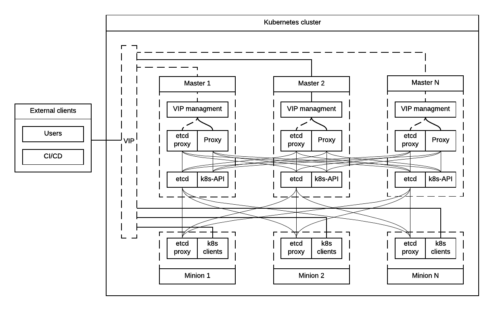
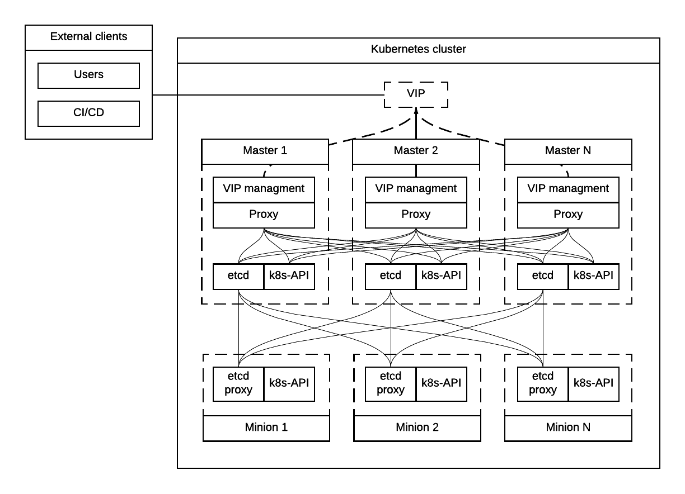
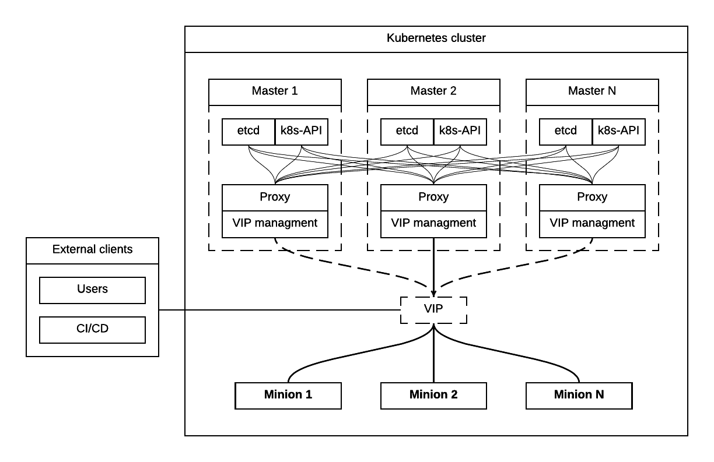

===========================================
Kubernetes Master Tier For 1000 Nodes Scale
===========================================

.. toctree::
   :maxdepth: 2
   :caption: Table of Contents

Introduction
------------

This document describes architecture, configuration and installation
workflow of Kubernetes cluster for OpenStack Containerised Control Plane
(CCP) on a set of hosts, either baremetal or virtual.

Scope of the document
~~~~~~~~~~~~~~~~~~~~~

This document does not cover preparation of host nodes and installation
of a CI/CD system. This document covers only Kubernetes and related
services on a preinstalled operating system with configured partitioning
and networking.

Monitoring related tooling will be installed on ready to use Kubernetes
as Pods, after Kubernetes installer finishes installation. This document
does not cover architecture and implementation details of monitoring and
profiling tools.

Lifecycle Management section describes only Kubernetes and related
services. It does not cover services which run on top of Kubernetes.

Solution Prerequisites
----------------------

Provisioner Prerequisites
~~~~~~~~~~~~~~~~~~~~~~~~~

Provides installed and configured operating system, networking,
partitioning. It should operate on its own subset of environment's
metadata. Some elements of that metadata will be used by installer tools
for Kubernetes Master and OpenStack Control tiers.

Hosts for Kubernetes cluster must be prepared by a provsioning system of
some sort. It is assumed that customer might have their own provisioning
system to handle prerequisites for this . If customer does not have
provisioning tools, we provide `*a default set of technologies for
that* <https://docs.google.com/document/d/15GOoF9d0k3h6wqJc3XeWXHIsoaZifALeve6t097Pa0E/edit>`__.

The following prerequisites are required from Provisioning system.

Operating System
^^^^^^^^^^^^^^^^

Ubuntu 16.04 is default choice for operating system (`*see MCP Product
Requirements* <https://docs.google.com/document/d/1b9g_wbf8dGQc45UAl-vvYf3ibk19Agw_LsMc8rFxJSs/edit#>`__).
It has to be installed and configured by provisioning system.

Networking
^^^^^^^^^^

Before the deployment starts networking has to be configured and
verified by underlay tooling:

-  Bonding.

-  Bridges (possibly).

-  Multi-tiered networking.

-  IP addresses assignment.

-  SSH access from CI/CD nodes to cluster nodes (is required for
       Kubernetes installer).

Such things as DPDK and Contrail can be most likely configured in
containers boot in privileged mode, no underlay involvement is required:

-  Load DKMS modules

-  Change runtime kernel parameters

Partitioning
^^^^^^^^^^^^

Nodes should be efficiently pre-partitioned (e.g. separation of /,
/var/log, /var/lib directories).

Additionally it’s required to have LVM Volume Groups, which further will
be used by:

-  LVM backend for ephemeral storage for Nova.

-  `*LVM backend for
       Kubernetes* <https://mirantis.jira.com/browse/PROD-5717>`__, it
       may be required to create several Volume Groups for Kubernetes,
       e.g. some of the services require SSD (InfluxDB), other will work
       fine on HDD.

Some customers also require Multipath disks to be configured.

Additional Ansible packages (optional)
^^^^^^^^^^^^^^^^^^^^^^^^^^^^^^^^^^^^^^

Currently `*Kubespray* <https://github.com/kubespray/>`__ project is
being used which provides Calico and Ubuntu/Debian support, there are
`*ongoing* <https://groups.google.com/forum/#!topic/kubernetes-dev/FPhzTXqLHQQ>`__
`*discussions* <https://github.com/kubernetes/kubernetes/issues/27948>`__
to integration of Kubespray Ansible playbooks (Kargo) to Kubernetes
community.

Ansible requires:

-  python2.7

-  python-netaddr

Ansible 2.1.0 or greater is required for Kargo deployment.

Ansible installs and manages Kubernetes related services (`*see
Components section* <#_jgyjupgztjj3>`__) which should be delivered and
installed as containers. Kubernetes has to be installed in HA mode, so
that failure of a single master node does not cause control plane
down-time.

The long term strategy should be to reduce amount of Ansible playbooks
we have to support and to do initial deployment and Lifecycle Management
with Kubernetes itself and related tools.

Node Decommissioning
^^^^^^^^^^^^^^^^^^^^

Many Lifecycle Management scenarios require nodes decommissioning
procedure. Strategy on decommissioning may depend on the customer and
tightly coupled with Underlay tooling.

In order to properly remove the node from the cluster, a sequence of
actions has to be performed by overlay tooling, to gracefully remove
services from cluster and migrate workload (depends on the role).

Possible scenarios of node decommissioning for underlay tooling:

-  Shut the node down.

-  Move node to bootstrap stage.

-  As a common practise we should not erase disks of the node, customers
       occasionally delete their production nodes, there should be a way
       to recover them (if they were not recycled).

CI/CD
~~~~~

Runs a chain of jobs in predefined order, like deployment and
verification. CI/CD has to provide a way to trigger a chain of jobs (git
push trigger -> deploy -> verify), also there should be a way to share
data between different jobs for example if IP allocation happens on job
execution allocated IP addresses should be available for overlay
installer job to consume.

Non comprehensive list of functionality:

-  Jobs definitions.

-  Declarative definition of jobs pipelines.

-  Data sharing between jobs.

-  Artifacts (images, configurations, packages etc).

User experience
^^^^^^^^^^^^^^^

1. User should be able to define a mapping of node and high level roles
       (master, minion) also there should be a way to define mapping
       more granularly (e.g. etcd master on separate nodes).

2. After the change in pushed CI/CD job for rollout is triggered,
       Ansible starts Kubernetes deployment from CI/CD via SSH (the
       access from CI/CD to Kubernetes cluster using SSH has to be
       provided).

Updates
^^^^^^^

When new package is published (for example libssl) it should trigger a
chain of jobs:

1. Build new container image (Etcd, Calico, Hyperkube, Docker etc)

2. Rebuild all images which depend on base

3. Run image specific tests

4. Deploy current production version on staging

5. Run verification

6. Deploy update on staging

7. Run verification

8. Send for promotion to production

Solution Components
-------------------

Overview
~~~~~~~~

Current implementation considers two high-level groups of services -
Master and Minion. Master nodes should run control-plane related
services. Minion nodes should run user’s workload. In the future,
additional Network node might be added.

There are few additional requirements which should be addressed:

-  Components placement should be flexible enough to install most of the
       services on different nodes, for example it may be required to
       install etcd cluster members to dedicated nodes.

-  It should be possible to have a single-node installation, when all
       required services to run Kubernetes cluster can be placed on a
       single node. Using scale up mechanism it should be possible to
       make the cluster HA. It would reduce amount of resources required
       for development and testing of simple integration scenarios.

Common Components
~~~~~~~~~~~~~~~~~

-  Calico is an SDN controller that provides pure L3 networking to
       Kubernetes cluster. It includes the following most important
       components that run on every node in the cluster.

   -  Felix is an agent component of Calico, responsible for configuring
          and managing routing tables, network interfaces and filters on
          pariticipating hosts.

   -  Bird is a lightweight BGP daemon that allows for exchange of
          addressing information between nodes of Calico network.

-  Kubernetes

   -  kube-dns provides discovery capabilities for Kubernetes Services.

   -  kubelet is an agent service of Kubernetes. It is responsible for
          creating and managing Docker containers at the nodes of
          Kubernetes cluster.

Plugins for Kubernetes should be delivered within Kubernetes containers.
The following plugins are required:

-  CNI plugin for integration with Calico SDN.

-  Volume plugins (e.g. Ceph, Cinder) for persistent storage.

Another option which may be considered in the future, is to deliver
plugins in separate containers, but it would complicate rollout of
containers, since requires to rollout containers in specific order to
mount plugins directory.

Master Components
~~~~~~~~~~~~~~~~~

Everything from Common plus:

-  etcd is a distributed key-value storage that provides clustering and
       configuration management capabilities to Kubernetes.

-  Calico

   -  Calico-policy-agent

-  Kubernetes

   -  Kube-dns

   -  Kube-proxy (iptables mode)

   -  Kube-apiserver

   -  Kube-scheduler

   -  Kube-control-manager

Minion Components
~~~~~~~~~~~~~~~~~

Everything from Common plus:

-  etcd-proxy is a mode of operation of etcd which doesn't provide
       storage, but rather redirects requests to alive nodes in etcd
       clutser.

Optional Components
~~~~~~~~~~~~~~~~~~~

-  Contrail SDN is an alternative to Calico in cases when L2 features
       required.

-  Tools for debugging (see Troubleshooting below).

Solution Overview
-----------------

Components Overview
~~~~~~~~~~~~~~~~~~~

Proxy server
^^^^^^^^^^^^

Proxy server should forward traffic to alive backends, health checking
mechanism has to be in place to stop forwarding traffic to unhealthy
backends.

Nginx is used to implement Proxy service. It is deployed in a pod, one
pod per cluster. It provides access to K8s API endpoint on a single
virtual IP address (VIP) by redirecting requests to instances of
kube-apiserver in a round-robin fashion. It exposes the endpoint both to
external clients and internal cliens (i.e. Kubernetes minions).

SSL termination can be optionally configured on Nginx server. From
there, traffic to instances of kube-apiserver will go over internal K8s
network.

Next steps in development of this architecture include implementation of
a Proxy server as an Ingress Controller. It will allow for closer
integration with K8s in terms of pods mobility and life-cycle management
operations. For example, Ingress Controller can be written to only relay
incoming requests to updated nodes during rolling update. It also allows
to manage virtual endpoint using native Kubernetes tools (see below in
High Availability Architecture section).

Kubernetes proxy
^^^^^^^^^^^^^^^^

Kubernetes proxy is installed on every node in the cluster, it allows
`*to forward traffic* <http://kubernetes.io/docs/admin/kube-proxy/>`__
to alive Kubernetes Pods. This is an internal component that exposes
Services created via Kubernetes API inside the cluster. Some
Ingress/Proxy server is required to expose services to outside of the
cluster via globally routed virtual IP (see above).

Etcd native proxy
^^^^^^^^^^^^^^^^^

Etcd in proxy mode runs on every node in cluster. It automatically
forwards requests to alive Etcd cluster members. `*According to the
documentation* <https://coreos.com/os/docs/latest/cluster-architectures.html#production-cluster-with-central-services>`__
it’s recommended etcd cluster architecture.

High Availability Architecture
~~~~~~~~~~~~~~~~~~~~~~~~~~~~~~

Since a Proxy Server (see above) is a single point of failure for
Kubernetes API and exposed Services, it must run in highly available
configuration. The following alternatives were considered for high
availability solution:

1. `*Keepalived* <http://www.keepalived.org/>`__

2. `*OSPF* <https://en.wikipedia.org/wiki/Open_Shortest_Path_First>`__

3. VIP managed by `*cluster management
       tools* <http://clusterlabs.org/pacemaker.html>`__

4. DNS

DNS round-robin
^^^^^^^^^^^^^^^

Implementing DNS based High Availability is very
`*problematic* <https://www.google.com/url?q=http://kubernetes.io/docs/user-guide/services/%23why-not-use-round-robin-dns&sa=D&ust=1468420895017000&usg=AFQjCNGFC1bXxOXHMPniI9EGNjO8nKNiZg>`__
due to caching on client side. It also requires additional tools for
fencing and failover of faulty Proxy Servers.

Keepalived
^^^^^^^^^^

Although `*Keepalived has problems with split brain
detection* <https://youtu.be/yq5nYPKxBCo?t=189>`__ there is `*a
subproject in
Kubernetes* <https://github.com/kubernetes/contrib/tree/master/keepalived-vip>`__
which uses Keepalived with an attempt to implement VIP management.

OSPF
^^^^

OSPF requires configuration of external routers. Default choice has to
be to use Virtual IP managed by cluster management tools.

Cluster Management tools
^^^^^^^^^^^^^^^^^^^^^^^^

As a cluster management tools for Virtual IP address we may consider
using etcd, it will require separate etcd installation to only manage
Virtual IP, careful research on this has to be done. Using etcd would
reduce amount of tooling we use to solve similar problems.

Phase #1 VIP for external and internal with native etcd proxy
~~~~~~~~~~~~~~~~~~~~~~~~~~~~~~~~~~~~~~~~~~~~~~~~~~~~~~~~~~~~~

First implementation of Highly Available Kubernetes with Kargo includes
using VIP for external and internal access to Kubernetes API, etcd proxy
for internal access to etcd cluster.

-  VIP for external and internal access to Kubernetes API.

-  VIP for external access to etcd.

-  Native etcd proxy on each node for internal access to etcd cluster.

|image1|

Phase #2 VIP for external and Proxy on each node for internal
~~~~~~~~~~~~~~~~~~~~~~~~~~~~~~~~~~~~~~~~~~~~~~~~~~~~~~~~~~~~~

After #1 implementation is finished we may consider to run testing for
the option, when each node which requires access to Kubernetes API also
has Proxy server installed, each Proxy forwards traffic to alive
Kubernetes API backends. External clients access Etcd and Kubernetes API
using VIP.

-  Internal access to APIs is done via proxies which are installed
       locally.

-  External access is done via Virtual IP address.

|image2|

Customizations
~~~~~~~~~~~~~~

If customers have their own system which can handle HA for external
users, they should be able to plug it in.

Currently we consider two possible customizations:

1. Customer has external Load Balancer to handle requests between master
       nodes. (which excludes VIP management and Proxy from Master
       nodes)

2. Customer provides their own solution for IP failover (e.g. OSPF) in
       this case VIP management system is not required.

Kubernetes configuration
~~~~~~~~~~~~~~~~~~~~~~~~

-  Leader election parameter for scheduler must be “true”.

-  Leader election parameter for controller manager must be “true”

Other parameters which are related to leader elections, must be
configurable and after destructive testing has to be adjusted
appropriately:

-  Leader elect lease duration

-  Leader elect renew deadline

-  Leader elect retry period

Logging
-------

`*Journald Docker
logging* <https://docs.docker.com/engine/admin/logging/overview/>`__
driver should be used, after Heka is started on the node, using `*Docker
plugin* <http://hekad.readthedocs.io/en/v0.10.0/config/inputs/docker_log.html>`__
it retrieves logs from Docker API and sends them to centralized storage.

Installation
------------

This section describes the installation of Kubernetes cluster on
pre-provisioned nodes.

Here is a list of containers in Kubernetes Master Tier that run under
control of systemd:

-  VIP manager

   -  This pod runs in hostNetwork mode.

-  Proxy

-  Etcd

   -  Should have directory mounted from host system.

-  Calico

   -  Depending on network architecture it may be required to disable
          node-to-node mesh and configure route reflectors instead.

-  Kubelet

   -  Certificates directory should be mounted from host system in Read
          Only mode.

All other containers are started as `*static
pods* <http://kubernetes.io/docs/admin/static-pods/>`__ by Kubelet in
'kube-system' namespace of Kubernetes cluster.

Note: In the future we may also consider starting all other services by
Kubelet, the problem here is that Kubelet requires
`*CNI* <http://kubernetes.io/docs/admin/network-plugins/>`__ plugin to
be configured prior its start, as a result when we try to start pods by
Kubelet including Calico, it tries to perform a hook for a plugin even
if a pod uses host networking, and
`*fails* <https://gist.github.com/rustyrobot/d087c9177534edec82c3d79ad9576935>`__
to do so, after several attempts it starts the container, but currently
such cases `*are not handled
explicitly* <https://github.com/kubernetes/kubernetes/blob/8cabbcbdcfa2bdf17c9ddc1db6754c862d6e08a2/pkg/kubelet/dockertools/docker_manager.go#L343-L350>`__
and we should not rely on that.

Common practices
~~~~~~~~~~~~~~~~

-  Manifests for static Pods should be mounted (read only) from host
       system, it will simplify update and reconfiguration procedure.

-  SSL certificates and any secrets should be mounted (read only) from
       host system, also they should have appropriate permissions.

Common steps
~~~~~~~~~~~~

1. Ansible retrieves SSL certificates.

2. Ansible installs and configures docker.

   a. Systemd config

   b. Use external registry

3. All control-plane related Pods must be started in separate namespace
       “kube-system”, `*in the
       future* <http://kubernetes.io/docs/user-guide/namespaces/>`__ we
       want to have access restriction to control-plane related Pods.

Master
~~~~~~

1. Ansible generates manifests for static pods and puts them into
       “/etc/kubernetes/manifests” directory.

2. Ansible generates configuration files (including systemd) for Proxy,
       VIP manager, Etcd, Calico, Kubelet.

3. Ansible starts all services in containers by systemd.

4. When Kubelet is started, it reads manifests and creates Pods
       accordingly.

5. Run health-check.

Minion
~~~~~~

1. Ansible generates manifests for static pods and puts them into
       “/etc/kubernetes/manifests” directory.

2. Ansible generates configuration files (including systemd) for Calico,
       Kubelet.

3. Ansible starts all non-kubernetes managed services in Docker
       containers, managed by systemd.

4. When Kubelet is started, it reads manifests and creates Pods
       accordingly.

5. Run health-check.

Lifecycle Management
--------------------

Validation
~~~~~~~~~~

Many LCM use-cases may cause destructive consequences for the cluster,
we should cover such use-cases with static validation, because it’s easy
to make a mistake when user edits the configuration files.

Examples of such use-cases:

-  Check that there are nodes with Master related services.

-  Check that quorum for etcd cluster is satisfied.

-  Check that scale down or node decommissioning does not cause data
       lose.

The validation checks should be implemented on CI/CD level, when new
patch is published, a set of gates should be started, where validation
logic is implemented, based on gates configuration they may or may not
block the patch for promotion to staging or production.

Scale up
~~~~~~~~

User assigns a role to a new node in configuration file, after changes
are committed in the branch, CI/CD runs Ansible playbooks.

Master
^^^^^^

1. Deploy additional master node.

2. Ensure that after new component is deployed, it’s available via
       endpoints.

Minion
^^^^^^

1. Deploy additional minion node.

2. Enable workload scheduling on new node.

Scale down
~~~~~~~~~~

Scaledown can also be described as Node Deletion. During scaledown user
should remove the node from configuration file, and add the node for
decommissioning.

Master
^^^^^^

1. Redeploy cluster, which would ensure, that node for deletion is not
       configured for any service.

2. Run node decommissioning.

Minion
^^^^^^

1. Make minion not available for scheduling.

2. Run workload migration (see “Workload Migration” section)

3. Run decommission of services which are managed by Ansible (see
       “Installation Process”).

4. Run node decommissioning.

Test Plan
~~~~~~~~~

-  Initial deploy

-  Scaleup

-  Scaledown

-  Update

   -  Intrusive

   -  Non-intrusive

-  Rollback

-  Rollout abort

Updating
--------

Updating is one the most complex Lifecycle management use-cases, that is
the reason it was decided to allocate dedicated section for that. We
split updates use-cases into two groups. The first group
“Non-intrusive”, is the simplest one, update of services which do not
cause workload downtime. The second “Intrusive”, is more complicated
since may cause updates downtime and has to involve a sequence of
actions in order to move stateful workload to different node in the
cluster.

Update procedure starts with publishing of new version of image in
Docker repositor. Then a service's metadata should be updated to new
version by operator of the cloud in staging or production branch of
configuration repository for Kubernetes cluster.

Non-intrusive
~~~~~~~~~~~~~

Non-intrusive type of update does not cause workload downtime, hence it
does not require workload migration.

Master
^^^^^^

Update of Master nodes with minimal downtime can be achieved if
Kubernetes installed in HA mode, minimum 3 nodes.

Key points in updating Master related services:

-  First action which has to be run prior to update is backup of
       Kubernetes related stateful services (in our case it is etcd).

-  Update of services managed by Ansible is done by ensuring version of
       running docker image and updating it in systemd and related
       services.

-  Update of services managed by Kubelet is done by ensuring of files
       with Pod description which contain specific version.

-  Nodes has to be updated one-by-one, without restarting services on
       all nodes simultaneously.

Minion
^^^^^^

Key points in updating Minimon nodes, where workload is run:

-  Prior to restarting Kubelet, Kubernetes has to be `*notified that
       Kubelet is under
       maintenance* <https://mirantis.jira.com/browse/PROD-6476>`__ and
       its workload must not be rescheduled to different node.

-  Update of Kubelet should be managed by Ansible.

-  Update of services managed by Kubelet is done by ensuring of files
       with Pod description.

Intrusive
~~~~~~~~~

Intrusive update is an update which may cause workload downtime,
separate update flow for such kind of updates has to be considered. In
order to provide update with minimal downtime for the tenant we want to
leverage VMs Live Migration capabilities. Migration requires to start
maintenance procedure in the right order by butches of specific sizes.

Common
^^^^^^

-  Services managed by Ansible, are updated using Ansible playbooks
       which triggers pull of new version, and restart.

-  If service is managed by Kubelet, Ansible only updates static
       manifest and Kubelet automatically updates services it manages

Master
^^^^^^

Since master node does not have user workload update the key points for
update are the same as for “Non-intrusive” use-cases.

Minion
^^^^^^

User’s workload is run on Minion nodes, in order to apply intrusive
updates, rollout system has to move workload to a different node. On big
clusters updates in butch-update will be required, to achieve faster
rollout.

Key requirements for Kubernetes installer and orchestrator:

-  Kubernetes installer is agnostic of which workloads run in Kubernetes
       cluster and in VMs on top of OpenStack which works as Kubernetes
       application.

-  Kubernetes installer should receive rollout plan, where the order,
       and grouping of nodes, update pf which can be rolled out in
       parallel are defined. This update plan will be generated by
       different tool, which knows “something” about types of workload
       run on the cluster.

-  In order to move workload to different node, installer has to trigger
       workload evacuation from the node.

   -  Node has to be `*disabled from
          scheduling* <https://mirantis.jira.com/wiki/display/NG/k8s+maintenance+node+status>`__
          of new workload.

   -  Node has to be considered as in maintenance mode, that
          `*unavailability of kubelet does not cause workload
          rescheduling* <https://mirantis.jira.com/browse/PROD-6476>`__.

   -  Installer has to trigger workload evacuation in kubelet, `*kubelet
          should use hooks defined in
          Pods* <https://mirantis.jira.com/browse/PROD-6444>`__, to
          start workload migration.

-  In rollout plan it should be possible to specify, when to fail
       rollout procedure.

   -  If some percent of nodes failed to update.

   -  There may be some critical for failure nodes, it’s important to
          provide per node configuration, if it is important to stop
          rollout procedure if this node failed to be updated.

Limitations
~~~~~~~~~~~

Hyperkube
^^^^^^^^^

Current Kubernetes deliver mechanism relies on Hyperkube distribution.
Hyperkube is a single binary file which contains all set of core
Kubernetes components, e.g. API, Scheduler, Controller, etc. The problem
with this approach is that bug-fix for API causes update of all core
Kubernetes containers, even if API is installed on few controllers, new
version has to be rolled out to all thousands of minions.

Possible solutions:

-  For different roles rollout different versions of Hyperkube. This
       approach significantly complicates versions and fixes tracking
       process.

-  Make split between those roles and create for them different images.
       The problem will remain since most of the core components are
       developed in a single repository and released together, hence it
       is still an issue, if release tag is published on the repo,
       rebuild of all core components will be required.

For now we go with native way of distribution until better solution is
found.

Update Configuration
~~~~~~~~~~~~~~~~~~~~

Update of configurations in most of the cases should not cause downtime.

-  Update of Kubernetes and related services (calico, etcd, etc).

-  Rotation of SSL certificates (e.g. those which are used for Kubelet
       authentication)

Abort Rollout
~~~~~~~~~~~~~

Despite the fact that this operation may be dangerous, user should be
able to interrupt update procedure.

Rollback
~~~~~~~~

Some of the operations are impossible to rollback, rollback may require
to have different flow of actions to be executed on the cluster.

Workload Migration
~~~~~~~~~~~~~~~~~~

Workload migration is being partly described in separate document
“\ `*Updates with minimal
downtime* <https://docs.google.com/document/d/1iVhSyJM8YkaJ6i-vwLDxmRUI9QpM9Yudeg0hcYtWrbA/edit>`__\ ”.

Troubleshooting
---------------

There should be a simple way to provide for a developer tooling for
debugging and troubleshooting. These tools should not be installed on
each machine by default, but there should be a simple way to get this
tools installed on demand.

-  Image with all tools required for debugging

-  Container should be run in privileged mode with host networking.

-  User can rollout this container to required nodes using Ansible.

Example of tools which may be required:

-  Sysdig

-  Tcpdump

-  Strace/Ltrace

-  Clients for etcd, calico etc

-  ...

Open questions
--------------

-  Networking node?

Related links
-------------

-  Self hosted Kubernetes proposal from CoreOS
       `*https://docs.google.com/document/d/1\_I6xT0XHCoOqZUT-dtpxzwvYpTR5JmFQY0S4gL2PPkU/edit#* <https://docs.google.com/document/d/1_I6xT0XHCoOqZUT-dtpxzwvYpTR5JmFQY0S4gL2PPkU/edit#>`__;\ ` <https://docs.google.com/document/d/1_I6xT0XHCoOqZUT-dtpxzwvYpTR5JmFQY0S4gL2PPkU/edit#>`__\ `*https://www.youtube.com/watch?v=tXyV3IQ8-0k&feature=youtu.be* <https://www.youtube.com/watch?v=tXyV3IQ8-0k&feature=youtu.be>`__\ ` <https://docs.google.com/document/d/1_I6xT0XHCoOqZUT-dtpxzwvYpTR5JmFQY0S4gL2PPkU/edit#>`__\ (`v <https://docs.google.com/document/d/1_I6xT0XHCoOqZUT-dtpxzwvYpTR5JmFQY0S4gL2PPkU/edit#>`__\ i\ `d <https://docs.google.com/document/d/1_I6xT0XHCoOqZUT-dtpxzwvYpTR5JmFQY0S4gL2PPkU/edit#>`__\ e\ `o <https://docs.google.com/document/d/1_I6xT0XHCoOqZUT-dtpxzwvYpTR5JmFQY0S4gL2PPkU/edit#>`__
       `d <https://docs.google.com/document/d/1_I6xT0XHCoOqZUT-dtpxzwvYpTR5JmFQY0S4gL2PPkU/edit#>`__\ e\ `m <https://docs.google.com/document/d/1_I6xT0XHCoOqZUT-dtpxzwvYpTR5JmFQY0S4gL2PPkU/edit#>`__\ o\ `) <https://docs.google.com/document/d/1_I6xT0XHCoOqZUT-dtpxzwvYpTR5JmFQY0S4gL2PPkU/edit#>`__

-  Architecture document on “Underlay toolchain proposal”
       `*https://docs.google.com/document/d/15GOoF9d0k3h6wqJc3XeWXHIsoaZifALeve6t097Pa0E/edit* <https://docs.google.com/document/d/15GOoF9d0k3h6wqJc3XeWXHIsoaZifALeve6t097Pa0E/edit>`__

-  Add link to LCM tooling research
       `*https://docs.google.com/spreadsheets/d/1O6ywpDlpGkF6P4fgqiIeGh8f56ZYa7KizdsdTWBtcQU/edit* <https://docs.google.com/spreadsheets/d/1O6ywpDlpGkF6P4fgqiIeGh8f56ZYa7KizdsdTWBtcQU/edit>`__

-  MCP Product Requirements
       `*https://docs.google.com/document/d/1b9g\_wbf8dGQc45UAl-vvYf3ibk19Agw\_LsMc8rFxJSs/edit#* <https://docs.google.com/document/d/1b9g_wbf8dGQc45UAl-vvYf3ibk19Agw_LsMc8rFxJSs/edit#>`__

-  MCP Networking Proposal
       `*https://docs.google.com/document/d/1LpiR7youHBa0F-b3Vq3GEv2loFIH7vYKjV2IGF5T2zk/edit* <https://docs.google.com/document/d/1LpiR7youHBa0F-b3Vq3GEv2loFIH7vYKjV2IGF5T2zk/edit>`__

-  Stateful containers in MCP
       `*https://docs.google.com/document/d/1zEh35NGSe2nVVFWdrSUz3HzBSC9EbN01k0Tk60ex\_1o/edit* <https://docs.google.com/document/d/1zEh35NGSe2nVVFWdrSUz3HzBSC9EbN01k0Tk60ex_1o/edit>`__

-  Keepalived based VIP managament for Kuberentes
       `*https://github.com/kubernetes/contrib/tree/master/keepalived-vip* <https://github.com/kubernetes/contrib/tree/master/keepalived-vip>`__

-  Updates with minimal downtime
       `*https://docs.google.com/document/d/1iVhSyJM8YkaJ6i-vwLDxmRUI9QpM9Yudeg0hcYtWrbA/edit#* <https://docs.google.com/document/d/1iVhSyJM8YkaJ6i-vwLDxmRUI9QpM9Yudeg0hcYtWrbA/edit#>`__

Contributors
------------

-  Evgeny Li

-  Matthew Mosesohn

-  Bogdan Dobrelya

-  Jedrzej Nowak

-  Vladimir Eremin

-  Dmytriy Novakovskiy

-  Michael Korolev

-  Alexey Shtokolov

-  Mike Scherbakov

-  Vladimir Kuklin

-  Sergii Golovatiuk

-  Aleksander Didenko

-  Ihor Dvoretskyi

-  Oleg Gelbukh

Appendix
--------

High Availability
~~~~~~~~~~~~~~~~~

This section contains some High Availability options we did the research
on which were considered as problematic or risky to implement.

VIP for external Kubernetes API on each node
^^^^^^^^^^^^^^^^^^^^^^^^^^^^^^^^^^^^^^^^^^^^

Another similar to “VIP for external and Proxy on each node for
internal” option, may be to install Kubernetes API on each node which
requires access to it instead of installing Proxy which forwards the
traffic to Kubernetes API on master nodes.

-  VIP on top of proxies for external access.

-  Etcd proxy on each node for internal services.

-  Kubernetes API on each node, where access to Kubernetes is required.

This approach may complicate authentication process, also it may cause
problems with `*admission
control* <http://kubernetes.io/docs/admin/admission-controllers/>`__.

|image3|

VIP for external and internal
^^^^^^^^^^^^^^^^^^^^^^^^^^^^^

In order to achieve High Availability of Kubernetes master proxy server
on every master node can be used, each proxy is configured to forward
traffic to all available backends in the cluster (e.g. etcd,
kubernetes-api), also there has to be a mechanism to achieve High
Availability between these proxies, it can be achieved by VIP managed by
cluster management system (see “High Availability between proxies”
section).

-  Internal and External access to Etcd or Kubernetes cluster is done
       via Virtual IP address.

-  Kubernetes API also access to Etcd using VIP.

|image4|

VIP for external native Kubernetes proxy for internal
^^^^^^^^^^^^^^^^^^^^^^^^^^^^^^^^^^^^^^^^^^^^^^^^^^^^^

We considered using native Kubernetes proxy for forwarding traffic
between APIs, Kubernetes proxy cannot work without Kubernetes API, hence
it should be installed on each node, where Kubernetes proxy is
installed. If Kubernetes API is installed on each node, there is no
reason to use Kubernetes proxy to forward traffic with it, internal
client can access the Kubernetes API through localhost.

.. |image2| image:: media/k8s_1000_nodes/image08.png
   :width: 6.37500in
   :height: 4.13889in

