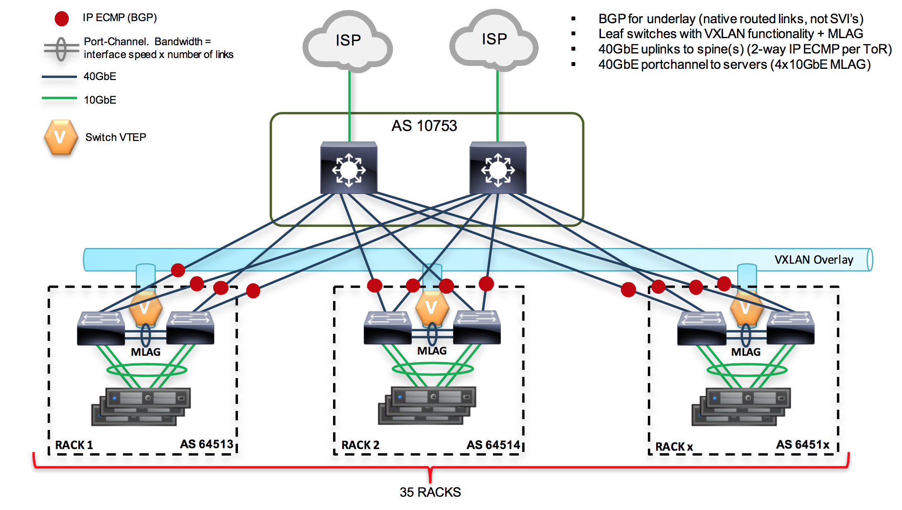
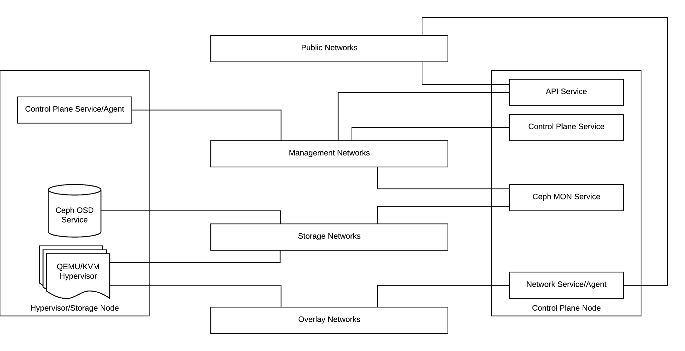
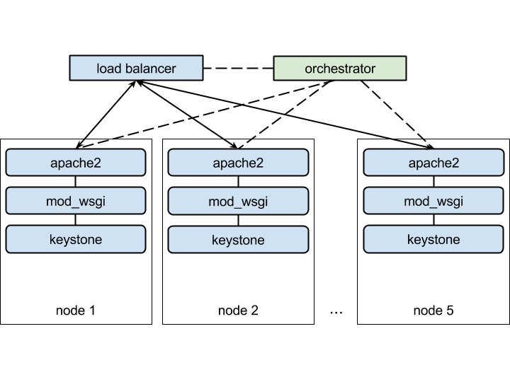
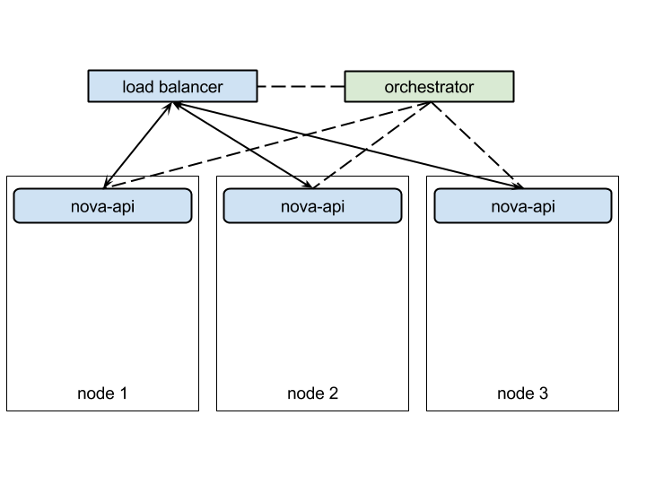
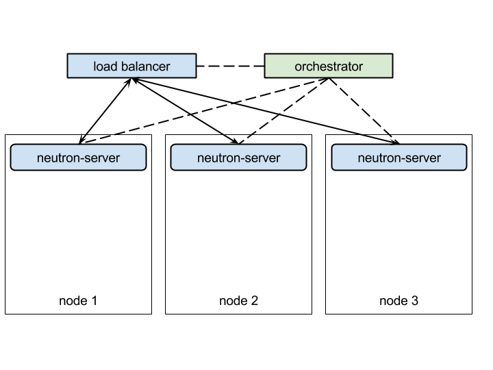
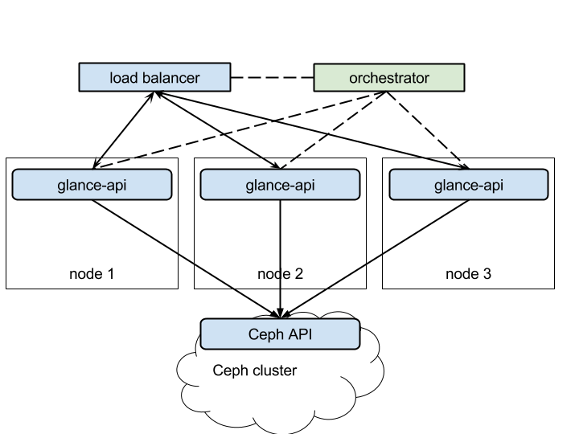

.. _ref_arch_for_1000_nodes:

===============================================
OpenStack Reference Architecture For 1000 Nodes
===============================================

This document proposes a new Reference Architecture (RA) of OpenStack
installation on top of Kubernetes that supports very large numbers of
compute nodes, using container technologies to improve scalability and
high availability of OpenStack Control Plane services. Containerization
of OpenStack components will also enable provisioning, patching and
upgrading large numbers of nodes in parallel, with high reliability and
minimal downtime.

Introduction/Executive Summary
------------------------------

This document contains recommendations for building specific clouds
depending for different use cases. All recommendations are validated and
tested on the described scale in both synthetic and real-world
configurations.

The proposed Reference Architecture applies the following open source
tools (among others):

-  OpenStack Control Plane is a scalable, modular cloud controller with
   support for all aspects of virtualized infrastructure.

-  Ceph is a distributed storage system that provides all the most
   popular types of storage to a virtualized infrastructure: object
   storage, virtual block storage and distributed file system.

-  InfluxDB is a time-series database optimized for collecting metrics
   from multiple sources in nearly-real time and providing access to
   recorded metrics.

-  Docker containers are used to isolate OpenStack services from the
   underlying operating system and control the state of every
   service more precisely.

Highlights
~~~~~~~~~~

Highlights of this document include:

-  Hardware and network configuration of the lab used to develop the
   Reference Architecture.

-  OpenStack Control Plane overview - Details how the OpenStack Control
   Plane is organized, including placement of the services for
   scaling and high availability of the control plane.

-  Data plane overview - Describes the approach to the data plane and
   technology stack used in the Reference Architecture.

-  Granular update and upgrade overview - Describes how the proposed
   Reference Architecture supports updating and upgrading on all
   levels from individual services to the whole OpenStack
   application.

Overview
--------

Hardware and network considerations
~~~~~~~~~~~~~~~~~~~~~~~~~~~~~~~~~~~

This section summarizes hardware considerations and network layouts for
the proposed solution. It defines the basic requirements to server
equipment hosting the cloud based on the CCP RA. Requirements to network
infrastructure in terms of L2 and L3 topologies, services like DNS and
NTP and external access provided in the network.

OpenStack Control Plane
~~~~~~~~~~~~~~~~~~~~~~~

The Control Plane consists of OpenStack component services, like Nova,
Glance and Keystone, and supplementary services like MySQL database
server and RabbitMQ server, all enveloped in Docker containers and
managed by an orchestrator (e.g. Kubernetes).

OpenStack Data Plane
~~~~~~~~~~~~~~~~~~~~

OpenStack data plane is constituted by backends to various drivers of
different components of OpenStack. They all fall into 3 main categories:

-  Hypervisor is data plane component backing OpenStack Compute (Nova),
   for example, libvirt or VMWare vSphere.

-  Networking is multiple data plane components under management of
   OpenStack Networking, for example, OpenVSwitch.

-  Storage has multiple components managed by OpenStack Storage and
   Images services. This category includes such systems as LVM,
   iSCSI, Ceph and others.

Granular Life Cycle Management, Updates and Upgrades
~~~~~~~~~~~~~~~~~~~~~~~~~~~~~~~~~~~~~~~~~~~~~~~~~~~~

This document describes the strategy of updating the OpenStack cloud and
its components to new version. The strategy of upgrade is based on
containerization of all those components. Containers effectively split
the state of the system into set of states of individual container.
Every container's state is managed mostly independently.

Hardware Overview
-----------------

Server Hardware Specifications
~~~~~~~~~~~~~~~~~~~~~~~~~~~~~~

The following server hardware was used in a lab to install and test the
proposed architecture solution. For Compute nodes, two configurations
are used.

Configuration One

-  Server model is Dell R630

-  2x12 Core CPUs E5-2680v3

-  256GB of RAM

-  2x800GB SSD Intel S3610

-  2x10GB Intel X710 dual-port NICs

Configuration Two

-  Server model is Lenovo RD550-1U

-  2x12 Core CPUs E5-2680v3

-  256GB of RAM

-  2x800GB SSD Intel S3610

-  2x10GB Intel X710 dual-port NICs

For Storage nodes, the following configuration is used.

-  Server model is Lenovo RD650

-  2x12 Core CPUs E5-2670v3

-  128GB RAM

-  2x480GB SSD Intel S3610

-  10x2TB HDD

-  2x10GB Intel X710 dual-port NICs

Resource Quantities
~~~~~~~~~~~~~~~~~~~

Compute/Controller Resources
^^^^^^^^^^^^^^^^^^^^^^^^^^^^

The number of Compute/Controller nodes in the environment: 516 nodes

The number of CPU Cores available to hypervisors and control plane
services: 12,384 cores

The amount of RAM available to hypervisors and control plane services:
132,096 GB

Storage Resources
^^^^^^^^^^^^^^^^^

* The number of Storage nodes in the environment: 45 nodes

* The number of CPU Cores available to storage services: 1,080 cores

* The amount of RAM available to storage cache: 5,760 GB

* The total size of raw disk space available on storage nodes: 900 TB

Servers are installed in 35 racks connected by ToR switches to spine
switches.

Network Schema
--------------

Underlay Network Topology
~~~~~~~~~~~~~~~~~~~~~~~~~

The environment employs leaf switches topology in the underlay network.
BGP protocol used in the underlay network to ensure multipath links
aggregation (IP ECMP) to leaf switches. ToR leaf switches are connected
to spines with 40GbE uplinks.

The leaf switches use VXLANs to provide overlay network to servers, and
MLAG aggregation to ensure availability and performance on the
downstream links. Servers are connected to ToR switches with 40GbE
port-channel links (4x10GbE with MLAG aggregation).

The following diagram depicts the network schema of the environment:

Figure 1. Network schema of the lab environment
'''''''''''''''''''''''''''''''''''''''''''''''

|image0|

No specific QoS configuration was made in the underlay network. Assume
that all services share the total bandwidth of network link without
guarantees for individual processes or sockets.

The following models of switching hardware were used throughout testing
effort in the schema described above:

-  Spine switches: Arista 7508E (4x2900PS, 6xFabric-E modules,
   1xSupervisorE module)

-  ToR switches: Arista 7050X

Network for OpenStack Platform
~~~~~~~~~~~~~~~~~~~~~~~~~~~~~~

OpenStack platform uses underlay network to exchange data between its
components, expose public API endpoints and transport the data of
overlay or tenant networks. The following classes of networks are
defined for OpenStack platform in proposed architecture.

-  Management network. This is the network where sensitive data exchange
   happens. Sensitive data includes authentication and authorization
   credentials and tokens, database traffic, RPC messages and
   notifications. This network also provides access to
   administrative API endpoints exposed by components of the
   platform.

-  Public network. Network of this class provides access to API
    endpoints exposed by various components of the platform. It also
    connects Floating IPs of virtual server instances to external
    network segments and Internet.

-  Storage network. Specialized network to transport data of storage
   subsystem, i.e. Ceph cluster. It also connects to internal Ceph
   API endpoints.

-  Overlay network. Networks of this class transport the payload of
   tenant networks, i.e. the private networks connecting virtual
   server instances. These networks are L2 only in most cases (i.e.
   don't require L3 addresses space in the underlay). The current
   architecture employs VXLANs for L2 encapsulation.

There can be one or more networks of each class in a particular cloud,
for example, Management network class can include separate segments for
messaging, database traffic and Admin API endpoints, and so on.

In addition to role segmentation, networks in one class can be separated
by scale. For example, Public network class might include multiple
per-rack segments, all connected by an L3 router.

Figure 2. Logical networks topology in OpenStack environment
''''''''''''''''''''''''''''''''''''''''''''''''''''''''''''

|image1|

Control Plane
-------------

OpenStack Overview
~~~~~~~~~~~~~~~~~~

OpenStack is a system that provides Infrastructure as a Service (IaaS).
IaaS is essentially a set of APIs that allow for creation of elements of
typical data center infrastructure, such as virtual servers, networks,
virtual disks and so on. Every aspect of an infrastructure is controlled
by a particular component of OpenStack:

-  OpenStack Compute (Nova) controls virtual servers lifecycle, from
   creation through management to termination.

-  OpenStack Networking (Neutron) provides connectivity between virtual
   servers and to the world outside.

-  OpenStack Image (Glance) holds base disk images used to boot the
   instances of virtual servers with an operating system contained
   in the image.

-  OpenStack Block Storage (Cinder) manages the virtual block storage
   and supplies it to virtual servers as block devices.

-  OpenStack Identity (Keystone) provides authentication/authorization
   to other components and clients of all APIs.

Guidelines for OpenStack at Scale
~~~~~~~~~~~~~~~~~~~~~~~~~~~~~~~~~

Currently, OpenStack scalability is limited by several factors:

-  Placement responsiveness desired

-  MySQL scalability

-  Messaging system scalability

-  Scalability of the SDN

-  Scalability of the SDS

Scheduler Scalability
^^^^^^^^^^^^^^^^^^^^^

In general, the scheduling strategy for OpenStack is a completely
optimistic determination which means the state of all things is
considered whenever a placement decision is made. As more factors are
added to the consideration set (special hardware, more compute nodes,
affinity, etc.) the time to place resources increases at a quadratic
rate. There is work being done on splitting out the scheduling and
placement parts of Nova and isolating them as a separate service, like
Cinder or Neutron. For now, however, this is a work in progress and we
should not rely on increased scheduler performance for another few
releases.

OpenStack can seamlessly accommodate different server types based on
CPU, memory and local disk without partitioning of the server pool.
Several partitioning schemes exist that provide ability to specify pools
of servers appropriate for a particular workload type. A commonly used
scheme is server aggregates, which allows specific image sets to be
scheduled to a set of servers based on server and image tags that the
administrator has defined.

MySQL Scalability
^^^^^^^^^^^^^^^^^

As almost all OpenStack services use MySQL to track state, scalability
of the database can become a problem. Mirantis OpenStack deploys with a
MySQL + Galera cluster which allows for reads and writes to be scaled in
a limited fashion. There is also the option to offload many types of
reads to asynchronous slaves which was introduced in the Icehouse
release. We should see support for both Galera and the asynchronous
approaches increase in Kilo and subsequent releases. There are OpenStack
installations in the wild with tens of thousands of nodes running under
both of these scaling models. However, careful tuning and care of the
databases is a very important consideration. MySQL is recommended to run
on dedicated nodes. The Control Plane DB should not be used by Tenant
Applications or other solutions like Zabbix; those should provision
another MySQL cluster on other physical nodes.

Messaging System Scalability
^^^^^^^^^^^^^^^^^^^^^^^^^^^^

A majority of OpenStack services use AMQP implementations (RabbitMQ and
Qpid) for message transport and RPC. As with MySQL, there are examples
of installations in the wild which have successfully scaled this
messaging infrastructure to tens of thousands of nodes. However, without
a deliberate federation strategy and/or careful tuning and maintenance,
these systems easily become unstable around 700-1000 compute nodes
depending on usage patterns. To scale OpenStack past 200 nodes, all
these areas will require planning.

OpenStack compute design is modular in nature. Beginning with KVM as the
only hypervisor choice does not constrain us from building a
multi-hypervisor cloud later, when need arises.

Services Overview
~~~~~~~~~~~~~~~~~

The following paragraphs describe how the individual services and
components should be placed and configured in the proposed Reference
Architecture. All services are divided into two categories: stateless
and stateful. Each category requires specific approach which is outlined
below.

Stateless Services
^^^^^^^^^^^^^^^^^^

Services of this type do not record their state in their environment.
Those services can be killed and restarted without risk of losing data.
Most of OpenStack component services are inherently stateless being
either HTTP-based API servers or message queue processors.

General approach to stateless services is envelop the service into
Docker container with minimal to no configuration embedded.

Stateful Services
^^^^^^^^^^^^^^^^^

Services that keep track of their state in some persistent storage and
cannot be restarted in clean environment without losing that state are
considered stateful. The main stateful component of the OpenStack
platform is MySQL state database. Most of other services rely on the
database to keep track of their own state.

Containers that run stateful services must have persistent storage
attached to them. This storage must be made available in case if the
container with stateful service should be move to another location. Such
availability can be ensured on application level via replication of some
sort, or on network level by redirecting connections from moving
container to the same storage location.

OpenStack Identity (Keystone)
-----------------------------

Keystone service provides identity to all other OpenStack services and
external clients of OpenStack APIs. The main component of Identity
service is an HTTP server that exposes an API of the service.

Keystone service is used by all other components of OpenStack for
authorization of requests, including system requests between services
and thus gets called a lot even if the platform is idle. This generates
load on CPU resources of server where it runs. Thus, it is recommended
to run Keystone service on dedicated node and not co-locate it with
other resource intensive components.

For availability and load distribution it is recommended to run at least
5 instances of Keystone at the scale of hundreds of nodes. Load balancer
with a Virtual IP address should be placed in front of the Keystone
services to ensure handling of failures and even distribution of
requests.

Per these recommendations, the required number of dedicated physical
nodes to run Keystone service is 5. These nodes can be used to host
other low footprint services. Resource intensive services should not run
on those nodes.

Apache2 Web Server
~~~~~~~~~~~~~~~~~~

Apache web server wraps Keystone and Horizon services and exposes them
as a web-services. However, since Horizon can generate significant load
on resources, it is not recommended to co-located it with Keystone. See
below for recommendations on scaling Horizon.

Figure 3. Keystone API servers in redundant configuration
'''''''''''''''''''''''''''''''''''''''''''''''''''''''''

|image2|

OpenStack Compute (Nova)
------------------------

Nova has multiple service not all of which are stateless. API server,
scheduler and conductor in particular are stateless, while nova-compute
service is not as it manages the state of data-plane components on a
compute node.

Nova API
~~~~~~~~

Web server that exposes Compute API of the OpenStack platform. This is a
stateless service. Nova API server consumes significant resources at
scale of hundreds of nodes.

Nova API server should run on a dedicated physical servers to ensure it
does not share resources with other services with comparably big
footprint. It can co-locate with more lightweight services.

For availability reasons, it is recommended to run at least 3 instances
of API server at any time. Load balancer with Virtual IP address shall
be placed in front of all API servers.

Figure 4. Nova API servers in redundant configuration
'''''''''''''''''''''''''''''''''''''''''''''''''''''

|image3|

Nova Scheduler
~~~~~~~~~~~~~~

Scheduling service of Nova is stateless and can be co-located with
services that have larger footprint. Scheduler should be scaled by
adding more service instances since its architecture is inherently
non-scalable due to using single thread model.

Using multiple scheduler processes might lead to unexpected
oversubscription of hypervisor resources if many simultaneous placement
requests are being served.

At the scale of hundreds of nodes use at least 8 instances of Scheduler.
Since they can be co-located with other services, it won't take any
additional physical servers from the pool. Schedulers can be placed to
nodes running other Nova control plane services (i.e. API and
Conductor).

Nova Conductor
~~~~~~~~~~~~~~

Centralized conductor service is recommended for large-scale
installations of Nova. It adds database interface layer for improved
security and complex operations. It is a stateless service that is
scaled horizontally by adding instances of it running on different
physical servers.

Conductor is resources-intensive service and should not be co-located
with other services. It runs on dedicated hardware nodes. One instance
of Conductor service should be running per physical node.

To ensure that the Conductor service is highly available, run 3
instances of the service at any time. This will require 3 dedicated
physical servers from the pool.

Figure 5. Scaling of Nova Scheduler and Conductor services
''''''''''''''''''''''''''''''''''''''''''''''''''''''''''

|image4|

Nova Compute
~~~~~~~~~~~~

Compute service is essentially an agent service of Nova. An instance of
it runs on every hypervisor node in an OpenStack environment and
controls the virtual machines and other connected resources on a node
level.

Compute service in the proposed architecture is not containerized. It
runs in hypervisor host and talks to different local and remote APIs to
get the virtual machines up and running. One instance of Compute service
runs per a hypervisor.

Services Placement
~~~~~~~~~~~~~~~~~~

Nova control plane services use at least 6 dedicated nodes:

-  3 nodes for 3 instances of Conductor service

-  3 nodes for 3 instances of API service

8 instances of Scheduler service are distributed between the said
dedicated nodes and/or nodes dedicated to other components of the
platform.

Load balancer is placed in front of the API services to ensure
availability and load distribution for the Compute API of OpenStack
platform.

Compute services run per-node on hypervisor hosts (compute nodes) in
non-redundant fashion.

OpenStack Networking (Neutron)
------------------------------

This component includes API server that exposes HTTP-based API and a set
of agents which actually manage data plane resources, such as IP
addresses, firewall and virtual switches.

Neutron Server
~~~~~~~~~~~~~~

An API server exposes Neutron API and passes all web service calls to
the Neutron plugin for processing. This service generates moderate load
on processors and memory of physical servers. In proposed architecture,
it runs on the same nodes as other lightweight API servers. A minimal of
3 instances of the server is recommended for redundancy and load
distribution.

Load balancer working in front of the API servers helps to ensure their
availability and distribute the flow of requests.

Figure 6. Neutron Server services in redundant configuration
''''''''''''''''''''''''''''''''''''''''''''''''''''''''''''

|image5|

Neutron DHCP agent
~~~~~~~~~~~~~~~~~~

DHCP agent of Neutron is responsible for assigning IP addresses to VMs.
The agent is horizontally scalable by adding new instances of it
distributed between different nodes. DHCP agent can be co-located to any
other services and can run on hypervisor hosts as well.

Neutron L3 agent
~~~~~~~~~~~~~~~~

L3 agent controls routing in Public and Private networks by creating and
managing namespaces, routers, floating IP addresses and network
translations. The agent can be scaled by adding instances. High
availability of the agent is ensured by running its instances in
Corosync/Pacemaker cluster or using orchestrator-driven clustering and
state tracking (e.g. Kubernetes events system with etcd).

The agent has low resources footprint and can be co-located with more
resource-intensive services, for example, Neutron Server.

Neutron L2 agent
~~~~~~~~~~~~~~~~

L2 agent manages data link layer configuration of the overlay network
for Compute nodes. It also provides L2 functions to L3 agent. The agent
is specific to Neutron plugin.

The L2 agent used with OpenVSwitch plugin generates high CPU load when
creates and monitors the OVS configurations. It has to run on any host
that runs nova-compute, neutron-l3-agent or neutron-dhcp-agent.

Services Placement
~~~~~~~~~~~~~~~~~~

Neutron control plane services require at least 3 nodes for redundancy
of Neutron Server. Three instances are recommended for high
availability. All micro services of Neutron could be co-located with the
Neutron Servers or with other components' services.

Load balancer should be placed in front of the Neutron Server to ensure
availability and load distribution for the Network API of the OpenStack
platform.

L3 and DHCP agents are co-located with instances of Neutron Server on
the same physical nodes. L2 agent works on every Compute node and on
every node that runs L3 and/or DHCP agent.

OpenStack Images (Glance)
-------------------------

Images service consists of API and indexing service. Both of them are
stateless and can be containerized.

Glance API
~~~~~~~~~~

This service exposes Images API of OpenStack platform. It is used to
upload and download images and snapshot.

Glance API server has low resource consumption and can be co-located
with other services. It does not require dedicated physical servers.

Glance API server scales by adding new instances. Load balancer is
required to provide a single virtual address to access the API. The load
can be evenly distributed between instances of Glance API.

Important parameter of the Image Service architecture is the storage
backend. The following types of storage are proposed for Glance in this
Reference Architecture:

-  Local filesystem

-  Ceph cluster

With local storage, the consistency of the store for all instances of
Glance API must be ensured by an external component (e.g. replication
daemon).

Ceph backend natively provides availability and replication of stored
data. Multiple instances of Glance API service work with the same shared
store in Ceph cluster.

Figure 7. Cinder API service in redundant configuration with Ceph back-end
''''''''''''''''''''''''''''''''''''''''''''''''''''''''''''''''''''''''''

|image6|

Glance Registry
~~~~~~~~~~~~~~~

Registry serves images metadata part of the Images API. It stores and
manages a catalog of images. It has low footprint and can share a
physical node with other resource intensive services.

Services Placement
~~~~~~~~~~~~~~~~~~

Micro services of Glance do not require dedicated physical servers. They
can be co-located with other services.

For the purposes of high availability and redundancy, at least 3
instances of Glance API service should run at any time. Load balancer
must be placed in front of those instances to provide single API
endpoint and distribute the load.

OpenStack Block Storage (Cinder)
--------------------------------

Storage service manages and exposes a virtual block storage. The server
that handles the management of low-level storage requires access to the
disk subsystem.

Cinder API
~~~~~~~~~~

This service exposes Volume API of the OpenStack platform. Volume API is
not very often used by other components of OpenStack and doesn't consume
too much resources. It could run on the same physical node with other
resource non intensive services.

For availability and redundancy purposes, it is proposed to run at least
3 instances of Cinder API. Load balancer should be placed in front of
these instances to provide distribution of load and failover
capabilities.

Figure 8. Cinder API service in redundant configuration
'''''''''''''''''''''''''''''''''''''''''''''''''''''''

|image7|

Cinder Scheduler
~~~~~~~~~~~~~~~~

Scheduler selects an instance of the Volume micro service to call when a
client requests creation of a virtual block volume. Scheduler is not
resource intensive and can be co-located with other services. It scales
horizontally by adding new instances of the service. For redundancy
purposes, the instances of scheduler service should be distributed
between different physical servers.

Cinder Volume
~~~~~~~~~~~~~

Volume service manages block storage via appropriate API which depends
on the technology in use. With Ceph as a provider of virtual block
storage, single instance of Cinder Volume service is required to manage
the Ceph cluster via its API. If virtual block storage is provided by
using LVM with local disks of Compute nodes, the Volume service must be
running on every Compute node in the OpenStack environment.

In Ceph case, it is recommended to run at least 3 instances of the
Volume service for the availability and redundancy of the service. Each
virtual volume is managed by one instance Volume service at a time.
However, if that instance is lost, another one takes over on its
volumes.

Figure 9. Cinder services in redundant configuration
''''''''''''''''''''''''''''''''''''''''''''''''''''

|image8|

Services Placement
~~~~~~~~~~~~~~~~~~

Cinder services do not require dedicated physical nodes. They run on the
same physical servers with other components of control plane of the
OpenStack platform.

The instances of Cinder API service are placed behind a loca balancer to
ensure the distribution of load and availability of the service.

OpenStack Dashboard (Horizon)
-----------------------------

Horizon dashboard provides user interface to the cloud's provisioning
APIs. This is a web application running on top of Apache2 web server.
For availability purposes, multiple instances of the server are started.
Load balancer is placed in front of the instances to provide load
distribution and failover. Horizon does not require dedicated physical
node. It can be co-located with other services of other components of
the OpenStack platform.

For security reasons, it is not recommended to use the same instances
Apache2 server to wrap both Horizon and Keystone API services.

RabbitMQ
--------

The messaging server allows all distributed components of an OpenStack
service to communicate to each other. Services use internal RPC for
communication. All OpenStack services also send broadcast notifications
via messaging queue bus.

Clustering
~~~~~~~~~~

The prerequisite for High Availability of queue server is the configured
and working RabbitMQ cluster. All data/state required for the operation
of a RabbitMQ cluster is replicated across all nodes. An exception to
this are message queues, which by default reside on one node, though
they are visible and reachable from all nodes.

Cluster assembly requires installing and using a clustering plugin on
all servers. Proposed solution for RabbitMQ clustering is the
`rabbitmq-autocluster <https://github.com/aweber/rabbitmq-autocluster>`__\ `*plugin* <https://github.com/aweber/rabbitmq-autocluster>`__.

The RabbitMQ cluster also needs proper fencing mechanism to exclude
split brain conditions and preserve a quorum. Proposed solution for this
problem is using 'pause\_minority' `partition
mode <https://www.rabbitmq.com/partitions.html>`__ with the
rabbit-autocluster plugin.

Replication
~~~~~~~~~~~

Replication mechanism for RabbitMQ queues is known as 'mirroring'. By
default, queues within a RabbitMQ cluster are located on a single node
(the node on which they were first declared). This is unlike exchanges
and bindings, which can always be considered to be on all nodes. Queues
can optionally be made mirrored across multiple nodes. Each mirrored
queue consists of one master and one or more slaves, with the oldest
slave being promoted to the new master if the old master disappears for
any reason.

Messages published to the queue are replicated to all members of the
cluster. Consumers are connected to the master regardless of which node
they connect to, with slave nodes dropping messages that have been
acknowledged at the master.

Queue mirroring therefore aims to enhance availability, but not
distribution of load across nodes (all participating nodes each do all
the work). It is important to note that using mirroring in RabbitMQ
actually reduces the availability of queues by dropping performance by
about 2 times in
`tests <http://docs.openstack.org/developer/performance-docs/test_results/mq/rabbitmq/index.html>`__,
and eventually leads to `failures of
RabbitMQ <https://bugs.launchpad.net/oslo.messaging/+bug/1555007>`__
because of extremely high rate of context switches at node's CPUs.

There are two main types of messages in OpenStack:

-  Remote Procedure Call (RPC) messages carry commands and/or requests
       between microservices within a single component of OpenStack
       platform (e.g. nova-conductor to nova-compute).

-  Notification messages are issued by a microservice upon specific
       events and are consumed by other components (e.g. Nova
       notifications about creating VMs are consumed by Ceilometer).

In proposed OpenStack architecture, only notification queues are
mirrored. All other queues are not, and if the instance of RabbitMQ
server dies after a message sent, but before it is read, that message is
gone forever. This is a trade-off for significant (at least 2 times)
performance and stability boost in potential bottleneck service.
Drawbacks of this mode of operation are:

-  Long-running tasks might stuck in transition states due to loss of
       messages. For example, Heat stacks might never leave spawning
       state. Most of the time, such conditions could be fixed by the
       user via API.

Data Persistence
~~~~~~~~~~~~~~~~

OpenStack's RPC mechanism does not impose requirements for durable
queues or messages. Thus, no durability required for RabbitMQ queues,
and there are no 'disk' nodes in cluster. Restarting a RabbitMQ node
then will cause all data of that node to be lost. Since OpenStack does
not rely on RPC as a guaranteed transport, it doesn't break the control
plane. Clients shall detect failure of a server they are talking to and
connect to another server automatically.

RabbitMQ service considered stateless in terms defined in this document
due to the reasons mentioned above.

Networking Considerations
~~~~~~~~~~~~~~~~~~~~~~~~~

RabbitMQ nodes address each other using domain names, either short or
fully-qualified (FQDNs). Therefore hostnames of all cluster members must
be resolvable from all cluster nodes, as well as machines on which
command line tools such as rabbitmqctl might be used.

RabbitMQ clustering has several modes of dealing with `network
partitions <https://www.rabbitmq.com/partitions.html>`__, primarily
consistency oriented. Clustering is meant to be used across LAN. It is
not recommended to run clusters that span WAN. The
`Shovel <https://www.rabbitmq.com/shovel.html>`__ or
`Federation <https://www.rabbitmq.com/federation.html>`__ plugins are
better solutions for connecting brokers across a WAN. Note that `Shovel
and Federation are not equivalent to
clustering <https://www.rabbitmq.com/distributed.html>`__.

Services Placement
~~~~~~~~~~~~~~~~~~

RabbitMQ servers are to be installed on the dedicated nodes. Co-locating
RabbitMQ with other Control Plane services has negative impact on its
performance and stability due to high resource consumption under the
load. Other services that have different resource usage patterns can
prevent RabbitMQ from allocating sufficient resources and thus make
messaging unstable.

Based on that, RabbitMQ will require 3 dedicated nodes out of the pool
of Compute/Controller servers.

Alternatives
~~~~~~~~~~~~

RabbitMQ is a server of choice for OpenStack messaging. Other
alternatives include:

-  0MQ (ZeroMQ), a lightweight messaging library that integrates into
       all components and provides server-less distributed message
       exchange.

-  Kafka, a distributed commit log type messaging system, supported by
       oslo.messaging library in experimental mode.

ZeroMQ
^^^^^^

This library provides direct exchange of messages between microservices.
Its architecture may include simple brokers or proxies that just relay
messages to endpoints, thus reducing the number of network connections.

ZeroMQ library support was present in OpenStack since early releases.
However, the implementation assumed direct connections between services
and thus a full mesh network between all nodes. This architecture
doesn't scale well. More recent implementations introduce simple proxy
services on every host that aggregate messages and relay them to a
central proxy, which does host-based routing.

`Benchmarks <http://lists.openstack.org/pipermail/openstack-dev/2016-March/090451.html>`__
show that both direct and proxy-based ZeroMQ implementations are more
efficient than RabbitMQ in terms of throughput and latency. However, in
the direct implementation, quick exhaustion of network connections limit
occurs at scale.

The major down side of the ZeroMQ-based solution is that the queues
don't have any persistence. This is acceptable for RPC messaging, but
Notifications may require durable queues. Thus, if RPC is using ZeroMQ,
the Telemetry will require a separate messaging transport (RabbitMQ or
Kafka).

Kafka
^^^^^

Distributed commit log based service Kafka is supported in OpenStack's
oslo.messaging library as an experimental. This makes it unfeasible to
include in the Reference Architecture..

MySQL/Galera
------------

State database of OpenStack contains all data that describe the state of
the cloud. All components of OpenStack use the database to read and
store changes in their state and state of the data plane components.

Clustering
~~~~~~~~~~

The proposed clustering solution is based on the native
orchestrator-specific state management with etcd providing distributed
monitoring and data exchange for the cluster. Cluster operations will be
triggered by orchestrator events and handled by custom scripts.

Failover and fencing of failed instances of MySQL is provided by scripts
triggered by the orchestrator upon changes in state and availability of
the members of Galera cluster. State and configuration information is
provided by etcd cluster.

Data Persistence
~~~~~~~~~~~~~~~~

Galera implements replication mechanism to ensure that any data written
to one of the MySQL servers is synchronously duplicated to other members
of the cluster. When a new instance joins the cluster, one of the two
replication methods is used to synchronize it: IST or SST. If the
initial data set exists on the new node, incremental method (IST) is
used. Otherwise, full replication will be performed (SST).

Since all nodes in the cluster have synchronous copies of the data set
at any time, there is no need to use shared storage. All DB servers work
with the local disk storage.

Replication
~~~~~~~~~~~

Incremental synchronous replication is used to keep MySQL databases of
members in Galera cluster in sync. If a new member is added to the
cluster, full replication (SST) will be performed.

Full SST replication can take indefinite time if the data set is big
enough. To mitigate this risk, the proposed architecture includes a
number of hot stand-by MySQL servers in addition to one Active server.
The access to said servers is provided by an instance of a load balancer
(see details in Networking Considerations section).

Proposed architecture allows to quickly replace failing instances of
MySQL server without need to run full replication. It is still necessary
to restore the pool of hot standby instances whenever the failover event
occurs.

Networking Considerations
~~~~~~~~~~~~~~~~~~~~~~~~~

Load balancer is a key element of networking configuration of the Galera
cluster. Load balancer must be coordinated with the cluster, in terms
that it redirect write requests to appropriate instance of MySQL server.
It also ensures failover to hot standby instances and fencing of failed
active nodes.

Services Placement
~~~~~~~~~~~~~~~~~~

MySQL servers forming the Galera cluster must run on dedicated physical
servers due to their intensive use of node's resources.

Ceph Distributed Storage
------------------------

Summary
~~~~~~~

Ceph is a distributed storage system with built-in replication
capability. Architecture of Ceph is designed for resiliency and
durability.

Ceph provides few different APIs for different types of supported
storage:

-  Distributed file system

-  Object storage

-  Virtual block device

OpenStack platform generally uses Object API and Block Device API of
Ceph for Image and Virtual Block storage correspondingly.

Main components of Ceph are as follows.

-  A Ceph Monitor maintains a master copy of the cluster map. A cluster
   of Ceph monitors ensures high availability should a monitor
   daemon fail. Storage cluster clients retrieve a copy of the
   cluster map from the Ceph Monitor.

-  A Ceph OSD Daemon checks its own state and the state of other OSDs
   and reports back to monitors.

-  RADOS gateway exposes the Object API of the platform. This API is
   generally compatible with OpenStack Object Storage API, which
   allows to use it as a Glance back-end without additional
   modifications.

Ceph Monitor
~~~~~~~~~~~~

For reliability purposes, Ceph Monitors should be placed to different
physical nodes. Those nodes might be the Storage nodes themselves,
albeit that is not generally recommended. Proper resilience of the
cluster can be ensured by using 3 or 5 instances of Ceph Monitor, each
running on separate host.

Ceph OSD
~~~~~~~~

Every storage device requires an instance of Ceph OSD daemon to run on
the node. These daemons might be resource intensive under certain
conditions. Since one node usually have multiple devices attached to it,
there are usually more than one OSD process running on the node. Thus,
it is recommended that no other services are placed to the OSD nodes.

RADOS Gateway
~~~~~~~~~~~~~

This service exposes an Object API via HTTP. It have low resource
footprint and can be co-located with other services, for example, with a
Ceph Monitor. Multiple radosgw daemons should be used to provide
redundancy of the service. Load balancer should be placed in front of
instances of radosgw for load distribution and failover.

Services Placement
~~~~~~~~~~~~~~~~~~

Ceph scales very well by adding new OSD nodes when capacity increase is
required. So the size of the Ceph cluster may vary for different clouds
of the same scale. In this document, a cluster with 45 OSD nodes is
described.

Instances of Monitor service require 1 dedicated node per instance, to
the total of 3 nodes. RADOS gateway servers run on the same nodes as
Monitors.

Control Plane Operations Monitoring
-----------------------------------

Summary
~~~~~~~

Monitoring the OpenStack Control Plane infrastructure is essential for
operating the platform. The main goal of it is to ensure that an
operator is alerted about failures and degradations in service level of
the environment. Metering plays less important role in this type of
monitoring.

Currently proposed solution for infrastructure monitoring is produced by
Stacklight project.

Stacklight is a distributed framework for collecting, processing and
analyzing metrics and logs from OpenStack components. It includes the
following services:

-  Stacklight Collector + Aggregator

-  Elasticsearch + Kibana

-  InfluxDB + Grafana

-  Nagios

Stacklight Collector
~~~~~~~~~~~~~~~~~~~~

Smart agent that runs on every node in the OpenStack environment. It
collects logs, processes metrics and notifications, generates and sends
alerts when needed. Specialized instance of Collector called Aggregator
aggregates metrics on the cluster level and performs special correlation
functions.

Elasticsearch + Kibana
~~~~~~~~~~~~~~~~~~~~~~

These components are responsible for analyzing large amounts of textual
data, particularly logs records and files coming from OpenStack platform
nodes. Kibana provides graphical interface that allows to configure and
view correlations in messages from multiple sources.

A typical setup at least requires a quad-core server with 8 GB of RAM
and fast disks (ideally, SSDs). The actual disk space you need to run
the subsystem on depends on several factors including the size of your
OpenStack environment, the retention period, the logging level, and
workload. The more of the above, the more disk space you need to run the
Elaticsearch-Kibana solution. It is highly recommended to use dedicated
disk(s) for your data storage.

InfluxDB + Grafana
~~~~~~~~~~~~~~~~~~

InfluxDB is a time series database that provides high throughput and
real-time queries for reduced support of standard SQL capabilities like
efficiently updating records. Grafana exposes graphic interface to time
series data, displays graphs of certain metrics in time and so on.

The hardware configuration (RAM, CPU, disk(s)) required by this
subsystem depends on the size of your cloud environment and other
factors like the retention policy. An average setup would require a
quad-core server with 8 GB of RAM and access to a 500-1000 IOPS disk.
For sizeable production deployments it is strongly recommended to use a
disk capable of 1000+ IOPS like an SSD. See the `*InfluxDB Hardware
Sizing
Guide* <https://docs.influxdata.com/influxdb/v0.10/guides/hardware_sizing/>`__
for additional sizing information.

Nagios
~~~~~~

In Stacklight architecture, Nagios does not perform actual checks on the
hosts. Instead it provides transport and user interface for the alerting
subsystem. It receives alerts from Collectors and generates
notifications to the end users or cloud operators.

A typical setup would at least require a quad-core server with 8 GB of
RAM and fast disks (ideally, SSDs).

Services Placement
~~~~~~~~~~~~~~~~~~

InfluxDB and Elasticsearch subsystems of the Stacklight solution should
run on dedicated servers. Additionally, clustered InfluxDB needs at
least three nodes to form a quorum. Elasticsearch scales horizontally by
adding instances, each running on a separate node. At least three
instances of Elasticsearch are recommended.

Stacklight Aggregator service could share a physical node with other
low-profile services.

Nagios server can be co-located with Stacklight Aggregator due to its
low resource footprint.

The total of 5 additional physical nodes are required to install Control
Plane Operations Monitoring framework based on Stacklight.

Services Placement Summary
--------------------------

The following table summarizes the placement requirements of the
services described above.

Table 1. Placement requirements summary per a service of OpenStack platform
'''''''''''''''''''''''''''''''''''''''''''''''''''''''''''''''''''''''''''

+--------------------------+-----------------------+-----------------------------+--------------------+----------------------------+
| Service                  | Number Of Instances   | Number Of Dedicated Nodes   | Can Share A Node   | Requires a Load Balancer   |
+==========================+=======================+=============================+====================+============================+
| keystone-all             | 5                     | 5                           | no                 | yes                        |
+--------------------------+-----------------------+-----------------------------+--------------------+----------------------------+
| nova-api                 | 3                     | 3                           | no                 | yes                        |
+--------------------------+-----------------------+-----------------------------+--------------------+----------------------------+
| nova-scheduler           | 8                     | -                           | yes                | no                         |
+--------------------------+-----------------------+-----------------------------+--------------------+----------------------------+
| nova-conductor           | 3                     | 3                           | no                 | no                         |
+--------------------------+-----------------------+-----------------------------+--------------------+----------------------------+
| nova-compute\*           | -                     | -                           | yes                | no                         |
+--------------------------+-----------------------+-----------------------------+--------------------+----------------------------+
| neutron-server           | 3                     | -                           | yes                | no                         |
+--------------------------+-----------------------+-----------------------------+--------------------+----------------------------+
| neutron-dhcp-agent       | 3                     | -                           | yes                | no                         |
+--------------------------+-----------------------+-----------------------------+--------------------+----------------------------+
| neutron-l2-agent\*       | -                     | -                           | yes                | no                         |
+--------------------------+-----------------------+-----------------------------+--------------------+----------------------------+
| neutron-l3-agent         | 3                     | -                           | yes                | no                         |
+--------------------------+-----------------------+-----------------------------+--------------------+----------------------------+
| glance-api               | 3                     | -                           | yes                | yes                        |
+--------------------------+-----------------------+-----------------------------+--------------------+----------------------------+
| glance-registry          | 3                     | -                           | yes                | no                         |
+--------------------------+-----------------------+-----------------------------+--------------------+----------------------------+
| cinder-api               | 3                     | -                           | yes                | yes                        |
+--------------------------+-----------------------+-----------------------------+--------------------+----------------------------+
| cinder-scheduler         | 3                     | -                           | yes                | no                         |
+--------------------------+-----------------------+-----------------------------+--------------------+----------------------------+
| cinder-volume            | -                     | -                           | yes                | no                         |
+--------------------------+-----------------------+-----------------------------+--------------------+----------------------------+
| horizon/apache2          | 3                     | 3                           | no                 | yes                        |
+--------------------------+-----------------------+-----------------------------+--------------------+----------------------------+
| rabbitmq-server          | 3                     | 3                           | no                 | no                         |
+--------------------------+-----------------------+-----------------------------+--------------------+----------------------------+
| mysqld-server            | 3                     | 3                           | no                 | yes\*\*                    |
+--------------------------+-----------------------+-----------------------------+--------------------+----------------------------+
| ceph-mon                 | 3                     | 3                           | no                 | no                         |
+--------------------------+-----------------------+-----------------------------+--------------------+----------------------------+
| ceph-osd\*\*\*           | -                     | -                           | no                 | no                         |
+--------------------------+-----------------------+-----------------------------+--------------------+----------------------------+
| radosgw                  | 3                     | -                           | yes                | yes                        |
+--------------------------+-----------------------+-----------------------------+--------------------+----------------------------+
| lma-aggregator           | 1                     | 1                           | yes                | no                         |
+--------------------------+-----------------------+-----------------------------+--------------------+----------------------------+
| Influxdb + Grafana       | 3                     | 3                           | no                 | no                         |
+--------------------------+-----------------------+-----------------------------+--------------------+----------------------------+
| Elasticsearch + Kibana   | 3                     | 3                           | no                 | no                         |
+--------------------------+-----------------------+-----------------------------+--------------------+----------------------------+
| Nagios                   | 1                     | -                           | yes                | no                         |
+--------------------------+-----------------------+-----------------------------+--------------------+----------------------------+
| **TOTAL**                | -                     | 30                          | -                  | -                          |
+--------------------------+-----------------------+-----------------------------+--------------------+----------------------------+

\* this service runs on a Compute/hypervisor host

\*\* this service might require specialized load balancer (proxysql)

\*\*\* this service runs on a Storage/OSD node

Total number of nodes for control plane is 30 which is not so high
footprint at scale of 1000 nodes. However, it could be reduced further
by using cgroups and/or container orchestrator-specific mechanisms to
guarantee availability of certain amount of resources to certain
resource-intensive services running on the same node. This will allow to
co-located resource-intensive services with lower risk of interference
and reduce the footprint of the Platform's control plane.

Data Plane
----------

Compute Virtualization
~~~~~~~~~~~~~~~~~~~~~~

QEMU implementation of Linux KVM is used as a virtualization hypervisor.
The KVM runs under control of libvirtd daemon, configured and managed by
Nova Compute microservice (nova-compute).

Network
~~~~~~~

Depending on the picked Neutron plugin, data plane network might be
realized by different technology stacks. Reference architecture employs
OVS+VXLAN plugin, network data plane at compute hosts runs on
OpenVSwitch virtual switching software.

Storage
~~~~~~~

Local disks and Ceph cluster RBD volumes are both used to provide block
storage capability to different services in the platform.

Ephemeral
^^^^^^^^^

Disk files of the VM instances running in the cloud are stored in Ceph
distributed storage via RBD. This enables live migration of VMs and high
availability of data in certain cases.

Virtual Block Devices
^^^^^^^^^^^^^^^^^^^^^

Virtual block storage devices are provided by Ceph via RBD.

Images
^^^^^^

Images used by Nova to spin up new VM instances are stored in Ceph via
Glance service's back end driver.

Snapshot
^^^^^^^^

Snapshots are stored in Ceph.

Database
^^^^^^^^

Database files are kept on the local storage devices of nodes that run
database servers. The replication and availability of the data are
ensured by WSREP mechanism of Galera cluster.

Monitoring
^^^^^^^^^^

The monitoring metrics and time-series data are written to InfluxDB
database. The database keeps its files on a local storage, similar to
the approach taken for state database (see above).

Logs
^^^^

Logs are written to local disks of nodes, plus optionally to remote logs
collector service which is the part of Telemetry component of the
platform.

References
----------

This section contains references to external documents used in
preparation of this document.

1. `Testing on scale of 1000 compute nodes <http://docs.openstack.org/developer/performance-docs/test_results/1000_nodes/index.html>`__

2. `Performance testing of OpenStack <http://docs.openstack.org/developer/performance-docs/>`__

3. `RabbitMQ Clustering <https://www.rabbitmq.com/clustering.html>`__

4. `RabbitMQ High Availability <https://www.rabbitmq.com/ha.html>`__

5. `ZeroMQ Status Update <http://lists.openstack.org/pipermail/openstack-dev/2016-March/090451.html>`__

.. |image4| image:: media/image09.pmg
   :width: 6.50000in
   :height: 3.68056in

.. |image7| image:: media/image15.png"
   :width: 6.50000in
   :height: 3.68056in
.. |image8| image:: mediaimage17.png
   :width: 6.50000in
   :height: 3.68056in
