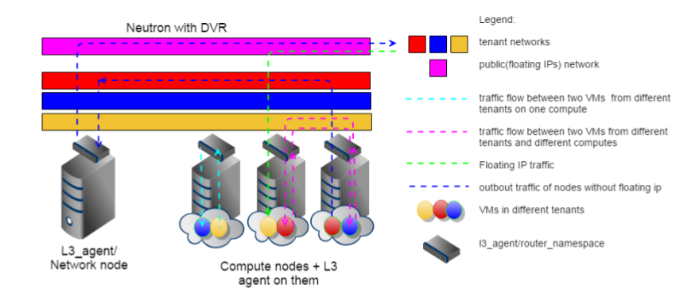

.. _enable_neutron_dvr:

=============================================
Enable Distributed Virtual Routing in Neutron
=============================================

This guide provides an instruction for enabling DVR support in a
CCP deployment.

.. NOTE:: DVR mode applies only for Neutron reference implementation with
ML2/OpenVSwitch plugin. In order to determine distributed routing capabilities
of other plugins/drivers please refer to their corresponding documentation.

Introduction
============

DVR
---

* Distributes L3 Routers across compute nodes when required by VMs
* L3 and Metadata Agents are running on each and every compute node
* Inter-subnets traffic is no longer affected by performance of one
  node with l3_agent
* Traffic for VMs with floating IP no longer affected by performance
  of one node with l3_agent
* Removal of single l3_agent node as single-point-of-failure for all
  inter-tenant traffic and Floating IP traffic

Sample CCP configuration
========================

.ccp.yaml may look like:

::

    builder:
      push: True
    registry:
      address: "127.0.0.1:31500"
    repositories:
      skip_empty: True
    nodes:
      node1:
        roles:
          - controller
          - openvswitch
      node[2-3]:
        roles:
          - compute
          - openvswitch
    roles:
      controller:
        - etcd
        - glance-api
        - glance-registry
        - heat-api-cfn
        - heat-api
        - heat-engine
        - horizon
        - keystone
        - mariadb
        - memcached
        - neutron-dhcp-agent
        - neutron-l3-agent
        - neutron-metadata-agent
        - neutron-server
        - nova-api
        - nova-conductor
        - nova-consoleauth
        - nova-novncproxy
        - nova-scheduler
        - rabbitmq
      compute:
        - nova-compute
        - nova-libvirt
        - neutron-l3-agent-compute
        - neutron-metadata-agent
      openvswitch:
        - neutron-openvswitch-agent
        - openvswitch-db
        - openvswitch-vswitchd
    configs:
        private_interface: ens7
        public_interface: ens7
        neutron:
          dvr: True
          physnets:
            - name: "physnet1"
              bridge_name: "br-ex"
              interface: "ens3"
              flat: true
              vlan_range: false

Compute node now has 2 additional roles:
neutron-l3-agent-compute and neutron-metadata-agent.

.. NOTE:: For Floating IPs to work properly, DVR requires each compute node
to have access to the external net.